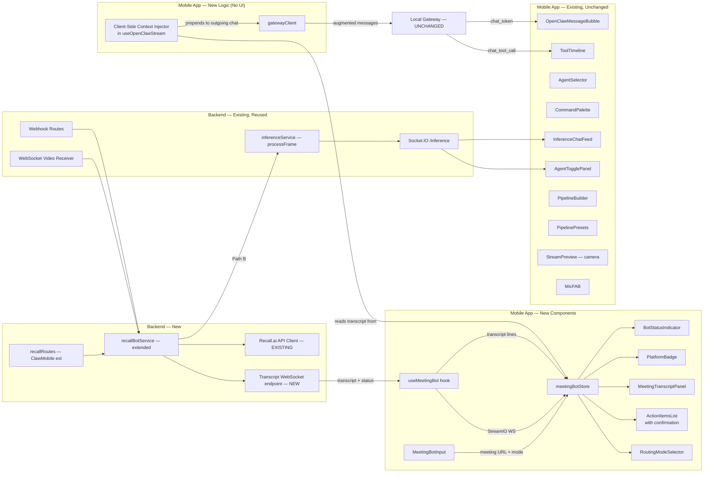
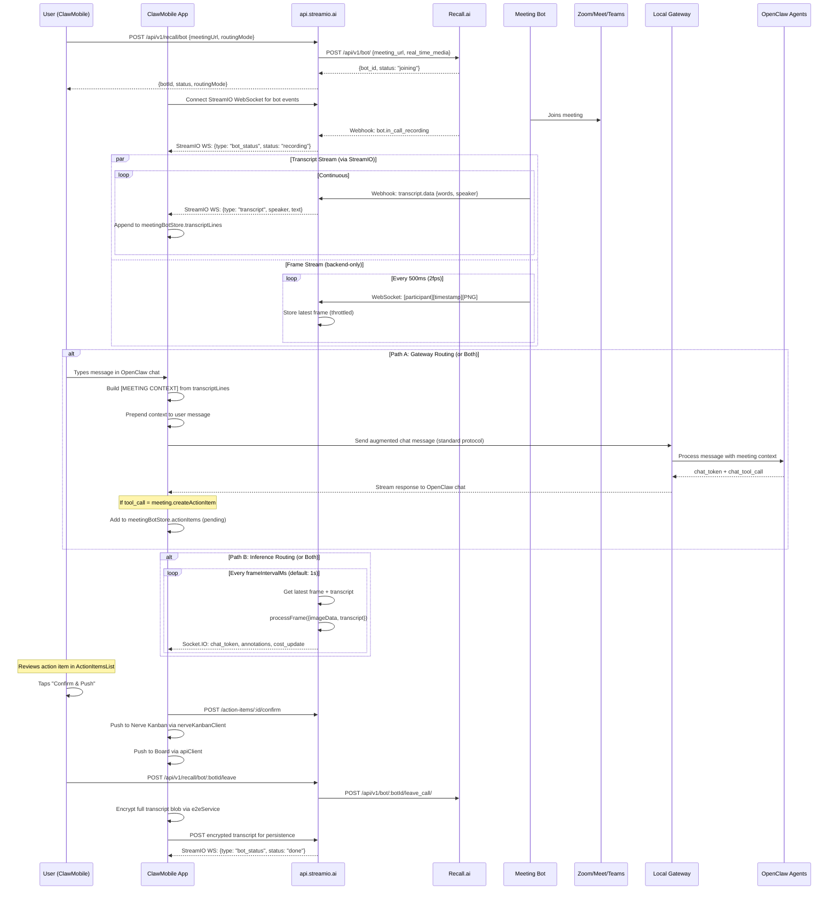
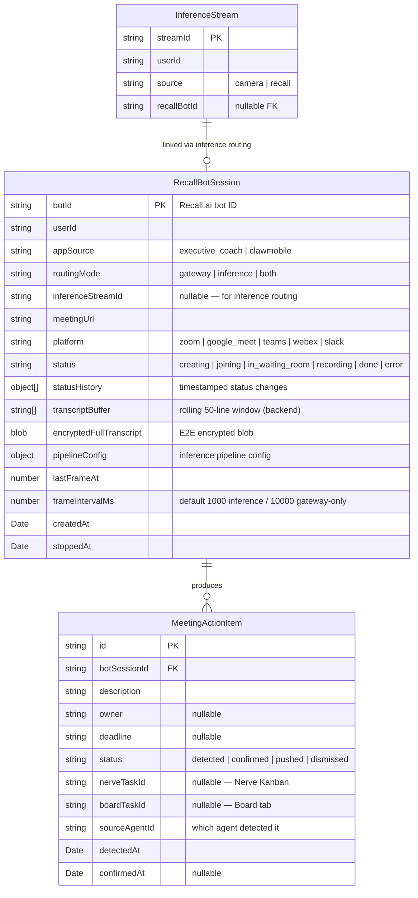

# System Architecture Plan: Recall.ai Meeting Bot Integration for ClawMobile

**Date:** 2026-03-25
**Author:** System Architecture Agent
**Status:** Final Draft (Revised)
**Base Reference:** Executive Coach Recall.ai Integration Spec (2026-03-21)

---

## Section 1: PROBLEM STATEMENT & SCOPE

### Problem Statement

ClawMobile connects to OpenClaw agents via the Gateway protocol (running on the user's local machine) for text-based chat, vision analysis, and tool-call orchestration. It also has a Stream.io inference pipeline (running on `api.streamio.ai`) for real-time camera-based multi-agent analysis. Users who are in live video meetings (Zoom, Google Meet, Microsoft Teams, Webex, Slack Huddles) cannot leverage either system in real-time because the app has no access to the meeting's video/audio stream.

This plan integrates **Recall.ai** as a meeting bot service that joins external video calls, captures real-time video frames and audio transcription, and routes them through **both** the OpenClaw Gateway protocol and the Stream.io inference pipeline — user's choice per session. The shared backend at `api.streamio.ai` already has Recall.ai infrastructure from the Executive Coach implementation; this plan extends it to serve ClawMobile's meeting intelligence use cases: action items, contract flagging, real-time Q&A, meeting summaries, and agent-driven task creation.

All existing functionality remains unchanged. The meeting bot is an **additive feature** — a new frame/transcript source that feeds into the existing systems. Camera streaming, OpenClaw chat, the inference pipeline, and all other features continue to work exactly as they do today.

### Key Architecture Insight

The Gateway server runs **locally** on the user's machine (or via Tailscale), not on `api.streamio.ai`. This means server-side middleware injection into the Gateway is not possible. Instead, **context injection happens client-side** — the mobile app prepends meeting transcript context to outgoing Gateway messages before sending them. Meeting bot lifecycle events (status, transcript, action items) flow via a **direct StreamIO channel** to `api.streamio.ai`, completely separate from the Gateway protocol.

This eliminates the need for any Gateway server changes and ensures compatibility with all Gateway providers (OpenClaw, NanoClaw, ZeroClaw, etc.).

### Out of Scope

- Calendar integration / auto-detecting upcoming meetings
- In-app video rendering of the meeting stream
- Post-meeting recording storage (Recall.ai recordings are ephemeral)
- Bot display name/avatar customization per platform
- Recall.ai billing dashboard or usage analytics in-app
- Custom transcription provider (use Recall.ai built-in; swap later if needed)
- Modifying any existing features — all changes are additive
- Gateway server/protocol changes — zero modifications to the local Gateway

### Requirements

**Functional Requirements:**

1. User pastes a meeting URL (Zoom, Google Meet, Teams, Webex, or Slack Huddle) and taps "Deploy Bot"
2. User selects routing mode: **Gateway** (OpenClaw agents via chat), **Inference** (Stream.io pipeline via AgentTogglePanel/PipelineBuilder), or **Both**
3. A Recall.ai bot joins the meeting and captures video frames (PNG, 2fps, 480×360) and audio transcription
4. **Gateway path:** The mobile app receives transcript from `api.streamio.ai` and prepends a `[MEETING CONTEXT]` block to outgoing Gateway chat messages — client-side context injection, no Gateway server changes
5. **Inference path:** Video frames are routed through the existing `processFrame()` pipeline with transcript attached, using the same AgentTogglePanel and PipelineBuilder UI as camera streams — camera streaming continues to work independently
6. Agent results stream to the app via the respective protocol (Gateway WebSocket or Socket.IO `/inference` namespace)
7. Detected action items surface in a confirmation UI — user must approve before pushing to both Nerve Kanban and Board tab
8. User can see bot status (joining, in call, recording, done, error)
9. User can remove the bot from the meeting at any time
10. Meeting URL validation rejects invalid URLs before deploying
11. User can change which agents receive meeting context mid-session
12. Meeting transcripts are persisted with E2E encryption (full transcript blob encrypted on session end)
13. Both routing paths can run simultaneously from the same meeting bot
14. All existing features (camera streaming, OpenClaw chat, board, kanban, messenger, etc.) remain fully functional and unmodified

**Non-Functional Requirements:**

- Transcript-to-agent-response latency: < 5 seconds (Gateway), < 8 seconds (Inference)
- Bot join time: < 30 seconds for ad-hoc joins
- StreamIO WebSocket resilience: auto-reconnect with exponential backoff (max 30 attempts)
- 1 active meeting bot per user at a time
- Recall.ai API key stored server-side only — never exposed to mobile
- Transcript buffer: rolling window of last 50 lines (~5 min) maintained client-side
- Encrypted transcript storage: full blob encrypted on session end using existing E2E system

**Constraints:**

- Shared backend: `api.streamio.ai` (reuses Executive Coach Recall.ai infrastructure)
- Recall.ai API key: same key as Executive Coach (`4c12d625d0a44d739d2fbebb963ef5fe37fd23a2`)
- Recall.ai region: `us-west-2`
- Recall.ai video: PNG at 2fps, 480×360px
- Recall.ai cost: **$0.65/hour** ($0.50 recording + $0.15 transcription)
- Gateway runs locally on user's machine — no server-side changes possible
- Kinde auth required for StreamIO API access (available via Settings tab)
- `recallService` uses `streamIOApiClient` (same auth, same base URL as inference)

---

## Section 2: USE CASES

The meeting bot gives OpenClaw agents something fundamentally new — **live, continuous business context** rather than one-off prompts. Combined with OpenClaw's tool call infrastructure, multi-agent orchestration, and cross-system integrations (Nerve Kanban, Board, Messenger, Terminal, Skills), the following use cases become possible.

### Core Use Cases (Phase 2-3)

These are the primary use cases that the integration is designed to support from launch.

| Use Case | Description | Routing Path |
|----------|-------------|-------------|
| **Live Action Items** | Extract commitments, owners, and deadlines in real-time | Gateway (tool calls) |
| **Contract & Legal Flagging** | Detect verbal agreements, liability language, compliance risks | Gateway (tool calls) |
| **Meeting Summarization** | Rolling summary updated every 2-3 minutes | Gateway or Inference |
| **Real-time Q&A** | Answer questions about meeting content as it unfolds | Gateway (interactive) |
| **Task Creation (with confirmation)** | Surface detected action items; user confirms before push to Nerve Kanban + Board | Gateway (tool calls → user approval) |
| **Participant Analysis** | Track speaker time, engagement, participation | Inference (periodic) |
| **Decision Logging** | Capture explicit decisions and reasoning | Gateway (tool calls) |
| **Follow-up Drafting** | Generate follow-up emails/messages from meeting outcomes | Gateway (tool calls → Messenger) |
| **Visual Context (Slides/Screenshare)** | Analyze shared screens, presentations, diagrams | Inference (frame-based) |
| **Sentiment & Tone Monitoring** | Detect tension, disagreement, enthusiasm | Inference (periodic) |

---

### Real-Time Meeting Actions

#### Live Negotiation Copilot
An agent monitors the transcript for pricing, terms, and concessions. When the other party makes an offer, the agent silently surfaces context to the user: *"Their list price for this tier is $72K. They've offered 30% off. Industry benchmark is $45-55K. You have room to counter."* This appears in the OpenClaw chat while the meeting continues — nobody else in the meeting knows the user has a copilot.

- **Routing:** Gateway (tool calls)
- **Agent type:** Specialized negotiation subagent with access to pricing data and deal history
- **Tool calls:** `meeting.addNote`, custom `negotiation.surfaceInsight`

#### Meeting-Aware Code Review
During a technical design review, a subagent watches the transcript for mentions of specific files, APIs, or architecture decisions. It uses tool calls to search the codebase via Terminal, then surfaces findings: *"They're discussing migrating auth to OAuth2 — the current implementation is in `src/auth/session.ts` (347 lines, last modified 3 weeks ago). 4 services depend on it."*

- **Routing:** Gateway (tool calls → Terminal)
- **Agent type:** Technical analysis subagent with terminal access
- **Tool calls:** Terminal commands (grep, find), `meeting.addNote`

#### Real-Time Compliance Witness
For regulated industries — a subagent trained on compliance frameworks (SOC2, HIPAA, GDPR) listens for commitments that trigger compliance obligations. *"John just verbally committed to storing EU user data in US-East. This conflicts with GDPR data residency requirements."*

- **Routing:** Gateway (tool calls)
- **Agent type:** Compliance subagent with regulatory knowledge
- **Tool calls:** `meeting.flagRisk(riskType, description, severity)`, `meeting.createActionItem`

---

### Multi-Agent Orchestration During Meetings

#### Agent Handoff Chains
A "Meeting Router" parent agent listens to the transcript and delegates to specialized subagents based on what's being discussed:
- Technical discussion → spawns a **Tech Analyst** subagent that pulls relevant docs
- Budget discussion → spawns a **Finance Analyst** subagent that cross-references past proposals
- Timeline discussion → spawns a **Project Tracker** subagent that checks Kanban for scheduling conflicts

Each subagent operates independently, surfaces findings, and self-terminates when the topic shifts. The parent agent orchestrates who's active based on conversation flow.

- **Routing:** Gateway (multi-agent)
- **Agent type:** Router parent + specialized subagents
- **Tool calls:** Subagent lifecycle management, domain-specific tools per subagent

#### Adversarial Prep Agent
Before a negotiation or pitch meeting, the user briefs an agent on context. During the meeting, one subagent plays the user's *advocate* (finding supporting arguments in the transcript), while another plays *devil's advocate* (identifying weaknesses in the user's position as they emerge). Both surface findings in real-time, giving the user a live strategy feed.

- **Routing:** Gateway (dual subagents)
- **Agent type:** Two competing subagents with opposing system prompts
- **Tool calls:** `meeting.addNote`, custom `strategy.surfaceArgument`

#### Multi-Meeting Context Stitching
An agent with access to previous meeting transcripts (stored encrypted in session history) correlates across meetings: *"Sarah said she'd have the API spec ready by March 15th — that was 8 days ago in last week's standup. She hasn't mentioned it today. Want me to flag it?"*

- **Routing:** Gateway (tool calls)
- **Agent type:** Continuity agent with historical transcript access
- **Tool calls:** `meeting.createActionItem`, transcript search across sessions

---

### Cross-System Automation

#### Live Meeting → Kanban + Board Pipeline
Beyond simple action items, a subagent watches for project management signals:
- **Scope changes** → auto-draft a new task with "Scope Change" tag
- **Blockers mentioned** → update existing tasks with "Blocked" status + the reason from transcript
- **Timeline shifts** → adjust due dates on related tasks with a note: *"Due date moved from March 30 to April 15 per meeting discussion"*

All changes surface as a batch at the end of the meeting for the user to approve/reject individually. Confirmed items push to both Nerve Kanban and the Board tab.

- **Routing:** Gateway (tool calls → Nerve Kanban + Board)
- **Agent type:** Project management subagent
- **Tool calls:** `meeting.createActionItem`, `kanban.createTask`, `board.createTask`

#### Meeting → Messenger Bridge
A subagent watches for "let's loop in [person not in the meeting]" patterns and drafts a Messenger message to that person with the relevant context excerpt: *"Hey Alex — in today's product sync, the team decided to switch from REST to GraphQL for the mobile API. Sarah is leading. Here's the relevant discussion: [excerpt]. They'd like your input on the schema."* The user approves before it sends.

- **Routing:** Gateway (tool calls → Messenger)
- **Agent type:** Communication subagent
- **Tool calls:** `meeting.sendFollowUp(recipient, subject, body)`

#### Meeting → Document Generation
A subagent accumulates decisions, action items, risks, and open questions throughout the meeting. When the meeting ends, it generates:
- Structured meeting minutes
- An updated project brief reflecting new decisions
- A diff of what changed from the previous meeting's state

These get queued as drafts the user can review, edit, and distribute.

- **Routing:** Gateway (tool calls)
- **Agent type:** Documentation subagent
- **Tool calls:** `meeting.addNote`, `meeting.sendFollowUp`, document generation tools

---

### Passive Intelligence Gathering

#### Stakeholder Mapping Agent
Over multiple meetings, a persistent agent builds a map of who influences what. *"In the last 4 meetings, every time infrastructure budget comes up, Maria defers to Tom. Tom has vetoed 2 of your 3 proposals. Consider getting Tom's buy-in before the next pitch."*

- **Routing:** Gateway (background analysis across sessions)
- **Agent type:** Organizational intelligence agent with cross-session memory
- **Tool calls:** `meeting.addNote`, custom `stakeholder.updateMap`

#### Sentiment Drift Monitor
Not just "is the tone positive or negative" but tracking *change over time within a meeting*. *"Energy dropped significantly when you brought up the timeline. Three participants went silent. Consider revisiting the timeline with more context."*

- **Routing:** Inference (periodic analysis) + Gateway (surfacing insights)
- **Agent type:** Behavioral analysis subagent
- **Tool calls:** `meeting.flagRisk(riskType: "sentiment_shift")`, `meeting.addNote`

#### Knowledge Gap Detector
An agent that notices when meeting participants are talking past each other — using different definitions for the same term, making assumptions others don't share, or agreeing on the surface while describing different outcomes. *"You and David are both saying 'API gateway' but you mean Kong and he's referring to AWS API Gateway. This will cause problems if not clarified."*

- **Routing:** Gateway (real-time analysis)
- **Agent type:** Communication clarity subagent
- **Tool calls:** `meeting.addNote`, `meeting.flagRisk(riskType: "miscommunication")`

---

### Skills System Integration

#### Meeting-Triggered Skill Execution
The Skills tab has discoverable agent skills. With meeting context, agents can detect topics that match known skills and offer to run them: *"The discussion about database migration matches the `db-migration-planner` skill. Want me to run it with the requirements mentioned in the last 5 minutes?"*

Skills can also chain based on meeting outcomes: meeting ends → `meeting-summary` skill → `action-item-extractor` skill → `kanban-batch-creator` skill → `follow-up-drafter` skill.

- **Routing:** Gateway (tool calls → Skills)
- **Agent type:** Skill router subagent
- **Tool calls:** Skill invocation, skill chaining

#### Live Research Subagent
When someone in the meeting mentions a competitor, technology, or claim, a subagent fires off a research query in the background and surfaces findings: *"They referenced 'Vercel's new edge middleware' — here's what it does and how it compares to your current setup: [summary]."*

- **Routing:** Gateway (background research)
- **Agent type:** Research subagent with web search or knowledge base access
- **Tool calls:** Web search tools, `meeting.addNote`

---

### Terminal Integration

#### Meeting-Driven DevOps
During an incident review meeting, an agent monitors the transcript. When someone says "can someone check the logs from last Thursday," a subagent executes terminal commands to pull relevant logs, formats the output, and surfaces it in the OpenClaw chat — all while the meeting continues.

- **Routing:** Gateway (tool calls → Terminal)
- **Agent type:** DevOps subagent with terminal access
- **Tool calls:** Terminal commands, `meeting.addNote`

#### Live Demo Support
During a demo meeting, an agent watches for audience questions and pre-fetches answers from the codebase, docs, or terminal output so the user can respond instantly without context-switching.

- **Routing:** Gateway (tool calls → Terminal + codebase search)
- **Agent type:** Demo support subagent
- **Tool calls:** Terminal commands, file search, `meeting.addNote`

---

### The Compounding Effect

The meeting bot turns live meeting context into a shared resource that any OpenClaw agent or subagent can consume. This means:

1. **Every existing agent becomes meeting-aware** without modification — client-side context injection is transparent
2. **Every existing tool call works during meetings** — Kanban, Board, Messenger, Terminal, Skills can all be triggered by live conversation patterns instead of manual prompts
3. **Multi-agent orchestration amplifies value** — a router agent + specialized subagents can cover more ground than any single agent, with each subagent focused on its domain
4. **Cross-session memory creates compounding intelligence** — agents that remember previous meetings can detect patterns, track commitments, and surface insights that no human would catch across weeks of meetings
5. **The user's hands stay free** — all of this happens while the user is in a meeting, doing what they'd normally do. The agents work in the background, surfacing only what matters

---

## Section 3: ARCHITECTURE & SYSTEM DESIGN

### High-Level Architecture

```mermaid
graph TB
    subgraph "External Meeting Platform"
        MEET[Zoom / Meet / Teams / Webex / Slack]
    end

    subgraph "Recall.ai Cloud"
        BOT[Recall.ai Bot]
        BOT -->|joins| MEET
        BOT -->|WebSocket push: PNG frames 2fps| WS_VIDEO
        BOT -->|Webhook: transcript.data| WH_TRANSCRIPT
        BOT -->|Webhook: bot status events| WH_STATUS
    end

    subgraph "StreamIO Backend (api.streamio.ai)"
        WS_VIDEO[WebSocket Video Receiver<br/>EXISTING from Exec Coach]
        WH_TRANSCRIPT[Transcript Webhook Handler]
        WH_STATUS[Bot Status Webhook Handler]

        RECALL_SVC[RecallBotService<br/>EXTENDED for ClawMobile]
        WS_VIDEO --> RECALL_SVC
        WH_TRANSCRIPT --> RECALL_SVC
        WH_STATUS --> RECALL_SVC

        RECALL_SVC -->|transcript + status events| STREAM_WS[StreamIO WebSocket<br/>to mobile app]
        RECALL_SVC -->|Path B: base64 frame + transcript| INFERENCE[processFrame<br/>EXISTING Pipeline]
        INFERENCE --> SOCKETIO[Socket.IO /inference<br/>EXISTING]
    end

    subgraph "User's Local Machine"
        GW[OpenClaw Gateway Server<br/>UNCHANGED]
        AGENTS[Connected Agents]
        GW <-->|standard protocol| AGENTS
    end

    subgraph "ClawMobile App"
        OC_UI[OpenClaw Tab<br/>+ Meeting Bot Panel]
        ST_UI[Stream Tab<br/>Camera + Meeting Inference]

        OC_UI -->|POST /api/v1/recall/bot| RECALL_SVC
        STREAM_WS -->|transcript + status| OC_UI
        SOCKETIO -->|Socket.IO events| ST_UI

        OC_UI -->|chat with [MEETING CONTEXT] prepended<br/>CLIENT-SIDE INJECTION| GW
        GW -->|chat_token, chat_tool_call| OC_UI

        OC_UI -->|confirmed action items| PUSH[Push to Both]
        PUSH --> NERVE[Nerve Kanban]
        PUSH --> BOARD[Board Tab]
    end
```

### Component Diagram



### Dual Routing Data Flow



### Key Design Decisions

#### 1. Client-side context injection — no Gateway server changes
- **Decision:** The mobile app prepends a `[MEETING CONTEXT]` block to outgoing Gateway chat messages. The local Gateway server and protocol are completely unchanged.
- **Rationale:** The Gateway runs on the user's local machine — `api.streamio.ai` cannot intercept or modify Gateway messages. Client-side injection achieves the same result (agents receive meeting context) without requiring server changes. This also works with every Gateway provider (OpenClaw, NanoClaw, ZeroClaw, etc.) automatically.
- **Tradeoffs:** Context injection only happens when the user sends a message or on a client-side timer. Agents cannot autonomously pull meeting context — they only receive it when the app sends it. This is acceptable because the primary use case is user-initiated Q&A and periodic context pushes.

#### 2. StreamIO WebSocket for bot lifecycle — separate from Gateway
- **Decision:** Meeting bot status, transcript lines, and action items flow from `api.streamio.ai` to the mobile app via a dedicated StreamIO WebSocket connection, completely bypassing the Gateway protocol.
- **Rationale:** The Gateway protocol has a fixed message type enum (`chat`, `chat_token`, `ping`, etc.) and runs against the local server. Adding `meeting_bot_status` would require protocol and server changes. Using the StreamIO channel (which already exists for inference) keeps the Gateway untouched.
- **Tradeoffs:** Two WebSocket connections active during a meeting (Gateway + StreamIO). Both already exist in the app — no new connections needed, just new event types on the StreamIO channel.

#### 3. Dual routing — Gateway AND Inference pipeline, user chooses
- **Decision:** Meeting data can be routed through the OpenClaw Gateway (for tool-call-driven use cases) and/or the Stream.io inference pipeline (for frame-based analysis), selectable per session.
- **Rationale:** Different use cases have different optimal paths. Action items, contract flagging, and Q&A are best served by Gateway agents with tool calls. Visual analysis (slides, screenshare) and real-time annotations are best served by the inference pipeline.
- **Tradeoffs:** Two routing paths require coordination. Mitigated by reusing existing infrastructure for both.

#### 4. Additive integration — all existing features unchanged
- **Decision:** The meeting bot is a new frame/transcript source that feeds into existing systems. No existing UI, pipeline, or service is modified in behavior.
- **Rationale:** Existing features are stable and working. The Stream tab keeps its camera preview and all controls. The OpenClaw tab keeps its full chat interface.

#### 5. Stream tab: meeting bot as additional inference source alongside camera
- **Decision:** When using Inference routing, meeting bot frames create a **separate inference stream** that coexists with the camera stream. Camera preview and all camera-based features remain fully functional.
- **Rationale:** Independent streams with independent pipelines. A user can run both simultaneously.

#### 6. Action items require user confirmation, then push to both Kanban and Board
- **Decision:** Agent-detected action items surface in `ActionItemsList` with "Confirm & Push" / "Dismiss" buttons. Confirmed items push to **both** Nerve Kanban (via `nerveKanbanClient`) and the Board tab (via `apiClient`).
- **Rationale:** Both task systems are active in the app. Users expect tasks to appear in whichever view they check.
- **Tradeoffs:** Dual push means maintaining two API calls. If one fails, the other still succeeds — partial push is better than no push.

#### 7. E2E encrypted transcript — full blob on session end
- **Decision:** The complete transcript is encrypted as a single blob using the existing E2E encryption system when the meeting session ends, then persisted to the backend.
- **Rationale:** Simpler than per-line encryption. The rolling transcript buffer is held in-memory (unencrypted) on the mobile device during the meeting for real-time use, then encrypted and uploaded when the bot leaves.
- **Tradeoffs:** No incremental persistence — if the app crashes mid-meeting, unuploaded transcript is lost. Acceptable because the backend also holds the raw transcript (encrypted at rest on the server).

#### 8. `recallService` uses `streamIOApiClient`
- **Decision:** The recall API client uses the existing `streamIOApiClient` for all calls to `api.streamio.ai`, which handles Kinde JWT authentication.
- **Rationale:** Recall endpoints live on the same backend. Users authenticate with Kinde via the Settings tab, and the auth token is stored in `streamIOAuthStore`. No separate auth flow needed.

#### 9. Shared Recall.ai infrastructure with Executive Coach
- **Decision:** Reuse `api.streamio.ai` infrastructure. Extend `recallBotService` with `appSource` field to distinguish ClawMobile vs. Executive Coach sessions.

#### 10. One meeting bot per user at a time
- **Decision:** Enforce 1 active Recall.ai bot per user across both apps.

---

## Section 4: DATA MODEL & API CONTRACTS

### Data Model



Note: `GatewaySession` is **not modified** — the Gateway knows nothing about meeting bots. Context injection is purely client-side.

### Mobile-Side State (meetingBotStore)

```typescript
interface MeetingBotState {
  // Session
  botId: string | null;
  status: BotStatus; // 'idle' | 'creating' | 'joining' | 'in_waiting_room' | 'recording' | 'done' | 'error'
  platform: MeetingPlatform | null;
  meetingUrl: string | null;
  routingMode: 'gateway' | 'inference' | 'both';
  error: string | null;
  duration: number;
  estimatedCostPerHour: number; // 0.65

  // Transcript (client-side buffer for context injection)
  transcriptLines: TranscriptLine[];        // Rolling 50-line window
  fullTranscript: TranscriptLine[];         // Complete for encryption + persistence

  // Inference-specific
  inferenceStreamId: string | null;

  // Action items (client-side tracking)
  actionItems: MeetingActionItem[];

  // Actions
  deployBot: (params: DeployBotParams) => Promise<void>;
  removeBot: () => Promise<void>;
  confirmActionItem: (itemId: string) => Promise<void>;
  dismissActionItem: (itemId: string) => Promise<void>;
  pushActionItem: (itemId: string) => Promise<void>;  // pushes to Nerve Kanban + Board
  reset: () => void;
}

interface TranscriptLine {
  speaker: string;
  text: string;
  timestamp: string;  // ISO 8601
}

interface MeetingActionItem {
  id: string;
  description: string;
  owner: string | null;
  deadline: string | null;
  status: 'detected' | 'confirmed' | 'pushed' | 'dismissed';
  nerveTaskId: string | null;
  boardTaskId: string | null;
  sourceAgentId: string;
  detectedAt: Date;
  confirmedAt: Date | null;
}
```

### API Contracts

#### REST Endpoints (on `api.streamio.ai`)

All endpoints use Kinde JWT auth via `streamIOApiClient`.

```
POST   /api/v1/recall/bot                         # Deploy bot
GET    /api/v1/recall/bot/:botId                  # Get bot status
POST   /api/v1/recall/bot/:botId/leave            # Remove bot
GET    /api/v1/recall/bot/active                  # Get active bot
POST   /api/v1/recall/bot/:botId/transcript       # Upload encrypted transcript blob
GET    /api/v1/recall/bot/:botId/transcript       # Download encrypted transcript blob
POST   /api/v1/recall/validate-url                # Validate meeting URL
POST   /api/v1/recall/webhooks/status             # Recall.ai status webhooks (signature-verified)
POST   /api/v1/recall/webhooks/transcript         # Recall.ai transcript webhooks (signature-verified)
```

Note: Action item confirmation/dismissal/push is handled **client-side** (updating local store + calling Nerve Kanban and Board APIs directly). No backend action item endpoints needed.

#### POST /api/v1/recall/bot — Deploy Bot

**Request:**
```json
{
  "meetingUrl": "https://zoom.us/j/123456789?pwd=abc",
  "appSource": "clawmobile",
  "routingMode": "both",
  "inference": {
    "pipeline": {
      "stages": [
        { "stageIndex": 0, "agents": ["slide-analyzer", "sentiment-monitor"], "passContextToNext": false }
      ]
    },
    "frameIntervalMs": 1000,
    "budget": { "maxTokens": 200000, "maxCost": 0.50, "onExceeded": "degrade" }
  }
}
```

Note: No `gateway` config needed in the request — Gateway context injection is entirely client-side.

**Response (201):**
```json
{
  "success": true,
  "botId": "recall-bot-abc123",
  "platform": "zoom",
  "status": "joining",
  "routingMode": "both",
  "inferenceStreamId": "stream-def456",
  "estimatedCostPerHour": 0.65,
  "transcriptWsUrl": "wss://api.streamio.ai/recall/transcript/recall-bot-abc123"
}
```

**Error (409):**
```json
{
  "success": false,
  "error": "Active meeting bot already exists",
  "activeBotId": "recall-bot-existing",
  "activeAppSource": "executive_coach"
}
```

#### POST /api/v1/recall/bot/:botId/leave — Remove Bot

**Response (200):**
```json
{
  "success": true,
  "message": "Bot removal initiated",
  "transcriptLines": 247,
  "duration": 1823
}
```

#### GET /api/v1/recall/bot/active — Active Bot

**Response (200):**
```json
{
  "active": true,
  "botId": "recall-bot-abc123",
  "appSource": "clawmobile",
  "platform": "zoom",
  "status": "recording",
  "routingMode": "both",
  "duration": 342,
  "meetingUrl": "https://zoom.us/j/123456789",
  "transcriptLines": 87,
  "transcriptWsUrl": "wss://api.streamio.ai/recall/transcript/recall-bot-abc123"
}
```

#### StreamIO WebSocket Events (Backend → Mobile)

The mobile app connects to `transcriptWsUrl` after bot deployment. Events:

| Event Type | Payload | Description |
|------------|---------|-------------|
| `bot_status` | `{ botId, status, platform, timestamp }` | Bot lifecycle changes |
| `bot_error` | `{ botId, error, subCode }` | Bot failure details |
| `transcript` | `{ speaker, text, timestamp }` | New transcript line (real-time) |
| `context_update` | `{ transcriptLines, duration }` | Periodic stats |

These events are **not** Gateway events — they flow over a StreamIO WebSocket, completely separate from the local Gateway connection.

#### Client-Side Context Injection Format

When the user sends a message in OpenClaw chat with an active meeting bot (Gateway or Both routing), the `useOpenClawStream` hook prepends:

```
[MEETING CONTEXT — Live from Zoom meeting]
Transcript (last 50 lines):
[14:01:23] John: Let's discuss the Q2 roadmap
[14:01:45] Sarah: I'll own the API migration by April 15th
[14:02:10] John: Great. What's the timeline?
...
[Action items pending: 2]
---
User message: What did Sarah commit to?
```

The agent receives this as a single chat message through the standard Gateway protocol. No protocol changes needed.

---

## Section 5: PHASED IMPLEMENTATION PLAN

### Phase 1: Backend — Extend Recall.ai Service for ClawMobile

**Goal:** Backend can deploy a meeting bot tagged as ClawMobile, stream transcript to the mobile app via WebSocket, and route frames through inference pipeline. Testable via API + Postman.

**Deliverables:**

1. **Extend `recallBotService.ts`** for ClawMobile:
   - Add `appSource` field → tags bot as `clawmobile` or `executive_coach`
   - Add `routingMode` handling: `gateway`, `inference`, or `both`
   - When `routingMode` includes `inference`: create inference session (`source: "recall"`) and wire frames to `processFrame()` — same as Executive Coach path
   - When `routingMode` is `gateway`-only: still capture transcript (for streaming to mobile) but skip frame processing

2. **`src/services/recallTranscriptStream.ts`** — NEW transcript WebSocket endpoint:
   - Per-bot WebSocket at `wss://api.streamio.ai/recall/transcript/:botId`
   - Authenticated via Kinde JWT (same as other StreamIO endpoints)
   - Streams `bot_status`, `bot_error`, `transcript`, `context_update` events to connected mobile clients
   - Fed by `handleTranscriptWebhook` and `handleStatusWebhook` on the backend
   - Auto-closes when bot session ends

3. **Extend `recallRoutes.ts`**:
   - `routingMode` and `appSource` in deploy request
   - `appSource` filtering on `/active` endpoint
   - `POST /transcript` endpoint for uploading encrypted transcript blob
   - `GET /transcript` endpoint for downloading encrypted transcript blob
   - Return `transcriptWsUrl` in deploy and active bot responses

4. **Environment config additions:**
   ```
   # Existing (shared with Executive Coach)
   RECALL_API_KEY=<server-side only>
   RECALL_API_REGION=us-west-2
   RECALL_WEBHOOK_SECRET=<from dashboard>

   # ClawMobile-specific
   RECALL_CLAWMOBILE_BOT_NAME=ClawMobile Meeting Bot
   RECALL_INFERENCE_FRAME_INTERVAL_MS=1000
   ```

**What is NOT in Phase 1 (moved or removed):**
- ~~`meetingContextMiddleware.ts`~~ — eliminated; context injection is client-side
- ~~Gateway server plugin point~~ — eliminated; Gateway is unchanged
- ~~Gateway-specific env vars~~ — eliminated; transcript window size is a mobile-side config

**Dependencies:** Existing Recall.ai infrastructure from Executive Coach deployed.

---

### Phase 2: Mobile App — Meeting Bot UI + Dual Routing

**Goal:** User can deploy a meeting bot, choose routing mode, see status, receive meeting intelligence via OpenClaw chat (with client-side context injection) and/or inference feed, and confirm action items before pushing to Kanban + Board. All existing features unchanged.

**Deliverables:**

1. **`stores/meetingBotStore.ts`** — Zustand store (see Data Model section for full interface)

2. **`services/recall/recallService.ts`** — API client using `streamIOApiClient`:
   - `deployMeetingBot(params)` → POST `/api/v1/recall/bot`
   - `removeMeetingBot(botId)` → POST `/api/v1/recall/bot/:botId/leave`
   - `getActiveMeetingBot()` → GET `/api/v1/recall/bot/active`
   - `uploadEncryptedTranscript(botId, blob)` → POST `/api/v1/recall/bot/:botId/transcript`
   - `downloadEncryptedTranscript(botId)` → GET `/api/v1/recall/bot/:botId/transcript`
   - `validateMeetingUrl(url)` → POST `/api/v1/recall/validate-url`
   - Client-side platform detection (same regex patterns as Executive Coach)

3. **`hooks/useMeetingBot.ts`** — NEW hook managing StreamIO WebSocket for bot events:
   - Connects to `transcriptWsUrl` after bot deployment
   - Handles `bot_status` → updates `meetingBotStore.status`
   - Handles `bot_error` → updates `meetingBotStore.error`
   - Handles `transcript` → appends to `meetingBotStore.transcriptLines` (rolling 50) and `fullTranscript`
   - Handles `context_update` → updates duration, line count
   - Auto-reconnects with exponential backoff
   - Disconnects on bot removal or `done` status

4. **Client-side context injection in `useOpenClawStream`** (augment existing hook):
   - Before calling `gatewayClient.send()` for a chat message:
     - Check if `meetingBotStore.status === 'recording'` and `routingMode` includes `gateway`
     - If yes, read `meetingBotStore.transcriptLines` (last 50 lines)
     - Prepend `[MEETING CONTEXT]` block to the message content
     - Send augmented message through standard Gateway protocol
   - This is ~15 lines of code added to the existing `send()` function
   - Also: set up a periodic auto-push timer (every 30s) that sends a context-only message to keep agents updated between user messages

5. **`components/meeting/MeetingBotInput.tsx`** — Deploy form:
   - URL input with platform auto-detection + PlatformBadge
   - `RoutingModeSelector`: segmented control — Gateway / Inference / Both
   - When Inference selected: pipeline picker (reuses existing PipelinePresets or PipelineBuilder)
   - "Deploy Bot" button with cost hint (~$0.65/hr)
   - Validation before submission

6. **`components/meeting/RoutingModeSelector.tsx`** — Mode picker:
   - Three-segment control: Gateway | Inference | Both
   - Gateway: "Agent chat — action items, summaries, Q&A"
   - Inference: "Pipeline analysis — slides, sentiment, annotations"
   - Both: "Full meeting intelligence"

7. **`components/meeting/BotStatusIndicator.tsx`** — Status display:
   - Status colors and labels (joining/waiting/recording/done/error)
   - Duration timer + transcript count + routing badge
   - "Remove Bot" button
   - Action item count badge (pending confirmation)

8. **`components/meeting/PlatformBadge.tsx`** — Platform icon with brand colors

9. **`components/meeting/MeetingTranscriptPanel.tsx`** — Live transcript:
   - Collapsible panel, real-time lines with speaker labels
   - Scroll-to-bottom behavior
   - Post-meeting: decrypts blob and displays full transcript

10. **`components/meeting/ActionItemsList.tsx`** — Confirmation UI:
    - Each item: description, owner, deadline, source agent badge
    - Two buttons: "Confirm & Push" / "Dismiss"
    - On push: calls `nerveKanbanClient.createTask()` AND `api.moveTask()` (Board)
    - Status progression: detected → confirmed → pushed (shows Kanban + Board links)
    - Dismissed items collapse to "Dismissed" section

11. **`app/(tabs)/openclaw.tsx` — Add MeetingBotPanel (additive only):**
    - Collapsible panel below header / above chat input
    - When idle: shows `MeetingBotInput`
    - When active: shows `BotStatusIndicator` + `MeetingTranscriptPanel` + `ActionItemsList`
    - All existing OpenClaw UI unchanged

12. **`app/(tabs)/stream.tsx` — Add meeting inference source indicator (additive only):**
    - Small "Meeting Bot Active" badge when inference or both routing
    - Camera preview, streaming, all controls unchanged
    - Meeting inference results tagged with `source: "recall"` in InferenceChatFeed

13. **`constants/streamio/config.ts` — Add recall endpoints to `StreamIOAPIConfig.endpoints`:**
    ```typescript
    // Recall.ai Meeting Bot
    recallDeployBot: '/api/v1/recall/bot',
    recallActiveBot: '/api/v1/recall/bot/active',
    recallBotStatus: '/api/v1/recall/bot',       // + /:botId
    recallLeaveBot: '/api/v1/recall/bot',         // + /:botId/leave
    recallTranscript: '/api/v1/recall/bot',       // + /:botId/transcript
    recallValidateUrl: '/api/v1/recall/validate-url',
    ```

14. **`types/recall.ts`** — Type definitions for all meeting bot interfaces

**Dependencies:** Phase 1 backend deployed. User has authenticated with Kinde via Settings tab.

---

### Phase 3: Agent Intelligence + Cross-Tab Integration

**Goal:** Purpose-built agent presets, meeting-specific tool definitions, and cross-tab integrations. All additive.

**Deliverables:**

1. **Meeting-specific tool definitions** for Gateway agents:
   ```typescript
   // Tool: meeting.createActionItem
   { name: "meeting.createActionItem", description: "Surface a detected action item for user confirmation",
     parameters: { description: string, owner?: string, deadline?: string } }

   // Tool: meeting.flagRisk
   { name: "meeting.flagRisk", description: "Flag contractual or compliance risk",
     parameters: { riskType: string, description: string, severity: "low"|"medium"|"high" } }

   // Tool: meeting.sendFollowUp
   { name: "meeting.sendFollowUp", description: "Queue a follow-up message via Messenger",
     parameters: { recipient: string, subject: string, body: string } }

   // Tool: meeting.addNote
   { name: "meeting.addNote", description: "Add a note to the meeting record",
     parameters: { content: string } }
   ```

2. **Client-side tool call interception** in `useOpenClawStream`:
   - When a `chat_tool_call` arrives with name `meeting.createActionItem`:
     - Parse the parameters and add to `meetingBotStore.actionItems` with status `detected`
     - Surface in `ActionItemsList` for user confirmation
   - When `meeting.flagRisk` arrives: surface as alert in BotStatusIndicator
   - When `meeting.addNote` arrives: append to transcript panel as agent note
   - When `meeting.sendFollowUp` arrives: queue in Messenger outbox (existing messenger service)

3. **Agent presets** (system prompt templates):
   - **Meeting Scribe**: Summarization + action item extraction
   - **Contract Watchdog**: Legal/contractual language flagging
   - **Action Tracker**: Commitments, deadlines, owner attribution
   - **Meeting Q&A**: Responds to user questions with meeting context
   - **Participant Analyst**: Speaking time distribution, engagement, sentiment

4. **Nerve Kanban + Board integration:**
   - Pushed action items appear on both Kanban tab and Board tab
   - Task metadata: `{ source: "meeting", meetingUrl, detectedAt, confirmedAt, agentId }`
   - Both tabs show "From Meeting" badge on meeting-sourced tasks

5. **Messenger integration:**
   - `meeting.sendFollowUp` tool call → queues message via existing messenger service
   - Post-meeting summary shareable to Messenger channels

6. **Activity Tab integration:**
   - Meeting bot lifecycle events in activity feed
   - Action item confirmations as activity entries

7. **CommandPalette extensions:**
   - `/meeting deploy <url>` — quick deploy with defaults
   - `/meeting stop` — remove active bot
   - `/meeting transcript` — open transcript panel
   - `/meeting items` — jump to action items

**Dependencies:** Phase 2 complete. Agent presets can be developed in parallel.

---

### Phase 4: Hardening + Polish

**Goal:** Production reliability, edge cases, UX refinements.

**Deliverables:**

1. **Webhook signature verification** — Validate Recall.ai signatures on all webhook endpoints
2. **Bot crash recovery** — On backend restart, query Recall.ai for active bots. On mobile app restart, call `/active` to sync state
3. **Session cleanup** — On `done` or `fatal`: encrypt + upload transcript, notify mobile, clean backend state
4. **Meeting URL normalization** — Handle variations (Zoom subdomains, g.co short links, Teams deep links)
5. **Rate limit handling** — Recall.ai 507 → exponential backoff (30s base, max 3 retries)
6. **Cost tracking** — Display Recall.ai cost alongside inference costs in both tabs
7. **Waiting room notification** — Alert user after 2 minutes: "Bot waiting to be admitted"
8. **Encrypted transcript search** — Client-side full-text search after decryption
9. **Post-meeting summary** — Auto-generate via agent when bot leaves; persist encrypted
10. **Offline resilience** — Bot continues server-side if mobile disconnects; reconnect syncs missed transcript lines
11. **Cross-app bot guard** — Clear error when deploying from ClawMobile with Executive Coach bot active (and vice versa)
12. **Inference stream source indicator** — Stream tab distinguishes camera vs. meeting bot results
13. **Kinde auth guard** — If user hasn't authenticated with Kinde, show prompt in MeetingBotInput before allowing deploy

**Dependencies:** Phase 3 complete.

---

## Section 6: INFRASTRUCTURE & DEPLOYMENT

### Shared Backend (`api.streamio.ai`)

No new infrastructure required. Changes are additive to existing Recall.ai services:

- Extend `recallBotService` with `appSource` and `routingMode` fields
- New `recallTranscriptStream` WebSocket endpoint for real-time transcript delivery to mobile
- Encrypted transcript upload/download endpoints
- No Gateway server changes — Gateway remains local and untouched

### WebSocket Endpoints

**Existing (shared with Executive Coach):**
- `wss://api.streamio.ai/recall/media/video` — Recall.ai video frames
- `wss://api.streamio.ai/recall/media/audio` — Recall.ai audio

**New (ClawMobile-specific):**
- `wss://api.streamio.ai/recall/transcript/:botId` — Real-time transcript + status events to mobile app

### Recall.ai Dashboard

Already configured for Executive Coach. No changes needed — same webhook URLs handle both apps (distinguished by `appSource` metadata).

### Observability

Extend existing logging with ClawMobile-specific tags:

- `recall.clawmobile.transcript_ws.connected` / `.disconnected`
- `recall.clawmobile.action_item.detected` / `.confirmed` / `.pushed` / `.dismissed`
- `recall.clawmobile.routing_mode` — track which modes are popular
- `recall.clawmobile.context_size` — track transcript window size being injected client-side
- **Dashboard:** Action items detected → confirmed → pushed funnel per meeting

### Cost Model

| Component | Cost | Notes |
|-----------|------|-------|
| Recall.ai recording | $0.50/hr | Per bot, shared billing |
| Recall.ai transcription | $0.15/hr | Built-in provider |
| Gateway agent inference | ~$0.01-0.05/message | User-initiated + periodic auto-push |
| Inference pipeline | ~$0.01-0.10/frame | Depends on agents + model |
| **Gateway-only meeting** | **~$0.70-0.80/hr** | Recording + transcription + agent chat |
| **Inference-only meeting** | **~$1.00-1.50/hr** | Recording + transcription + frame analysis |
| **Both routing modes** | **~$1.50-2.00/hr** | Full meeting intelligence |

---

## Section 7: OPEN QUESTIONS & NEXT STEPS

### Open Questions

1. **Agent model selection:** Which LLM should meeting intelligence agents use? Vision-capable (Gemini 2.0 Flash) for visual context vs. text-only (GPT-4o) for transcript-only. Recommend: text-only for Gateway path, vision-capable for Inference path.

2. **Auto-push cadence:** How often should the client-side context injector auto-push meeting context to the Gateway when the user hasn't sent a message? Recommend: every 30 seconds, configurable.

3. **Recall.ai API key billing:** Same key (simpler) vs. separate key (isolated billing). Recommend: same key, add `appSource` tag for internal cost attribution.

### Immediate Next Steps

1. **Extend `recallBotService.ts`** — Add `appSource` and `routingMode` fields. Test bot deployment with `appSource: "clawmobile"`.

2. **Build `recallTranscriptStream.ts`** — WebSocket endpoint that streams transcript and status events to the mobile app. Test with a real meeting.

3. **Build `useMeetingBot` hook** — Connect to transcript WebSocket, populate `meetingBotStore`. Test transcript lines flowing in real-time.

4. **Add context injection to `useOpenClawStream`** — Prepend `[MEETING CONTEXT]` to outgoing Gateway messages. Test that an agent receives and reasons about the transcript.

5. **Build `MeetingBotInput` + `ActionItemsList`** — Deploy form and confirmation UI. Test end-to-end: paste URL → bot joins → transcript appears → agent responds → action item detected → user confirms → pushes to Kanban + Board.
