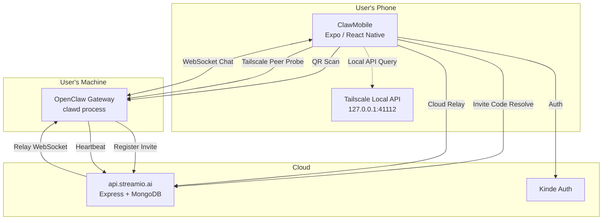
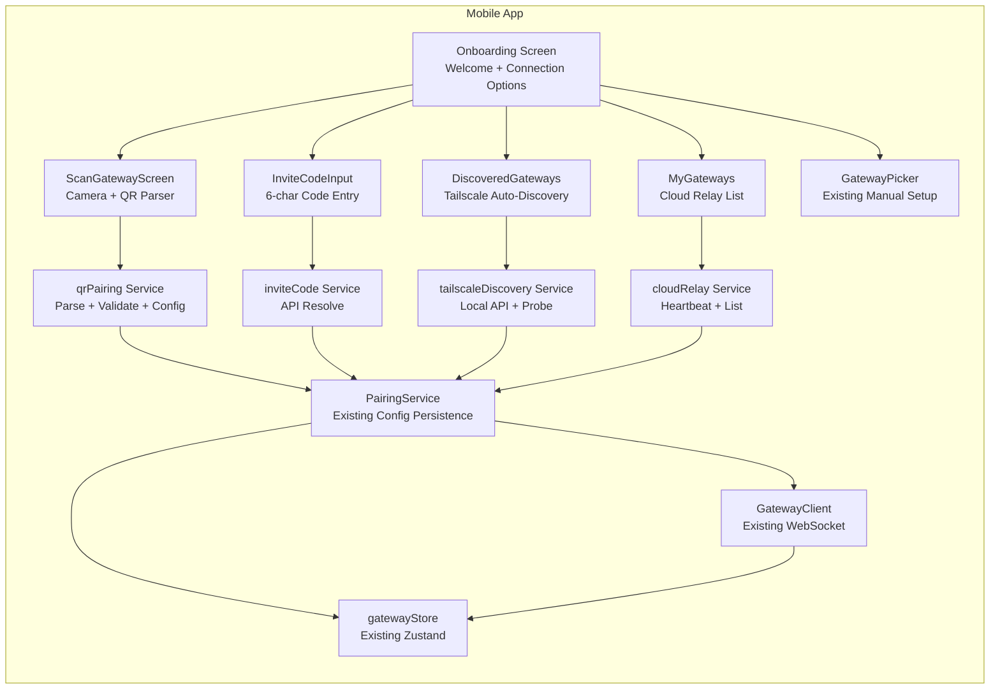
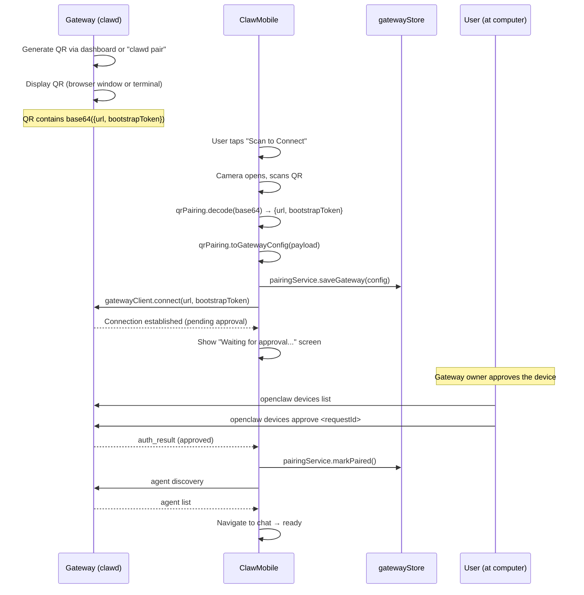
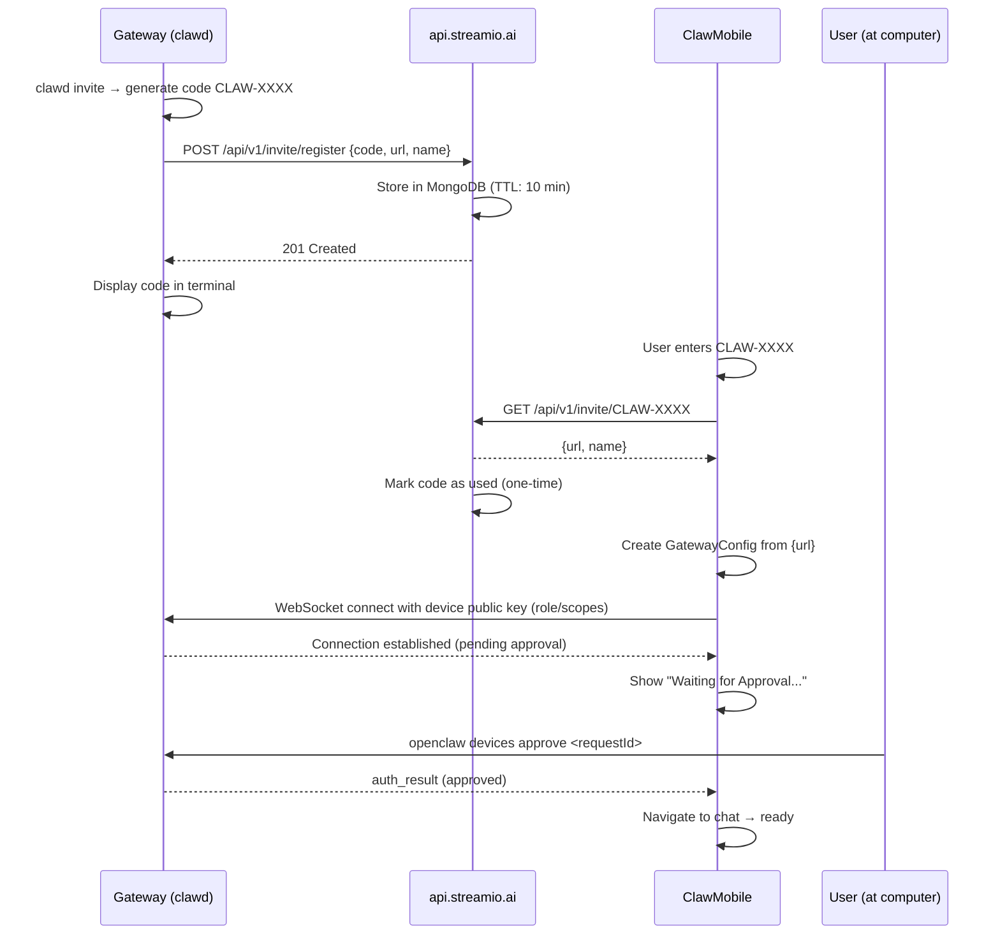
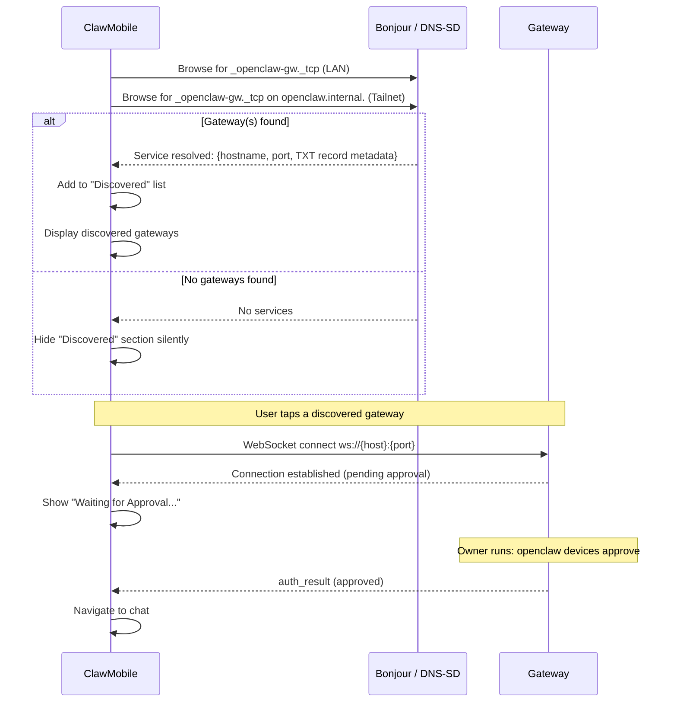
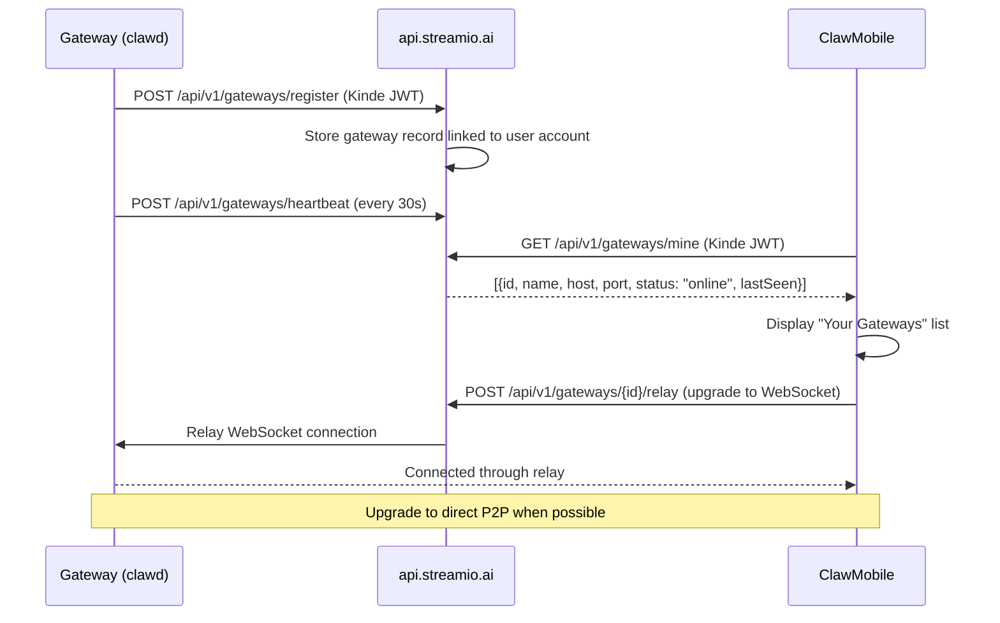

# Gateway Onboarding — Zero-Friction First Chat Implementation Plan

**Date:** 2026-03-26
**Status:** Draft
**Spec:** `GATEWAY_ONBOARDING_SPEC.md`
**Goal:** Reduce download-to-first-chat from 6 manual steps to 1-2 taps

---

## Section 1: PROBLEM STATEMENT & SCOPE

### Problem Statement

ClawMobile requires users to manually enter a Tailscale hostname/IP, port, auth method, and password to connect to their OpenClaw Gateway — a 6-step process that takes ~3 minutes and causes non-technical users to abandon. This plan implements four progressive connection methods (QR Code, Invite Code, Tailscale Auto-Discovery, Cloud Relay) that eliminate manual network configuration and get users chatting within 15 seconds of opening the app.

### Out of Scope

- Demo Gateway / hosted OpenClaw instance — users must run their own Gateway
- Changes to the existing manual setup flow (it stays as the "Advanced" fallback)
- Renaming the URL scheme from `asana-copilot://` to `clawmobile://`
- User account creation flows (Kinde auth already exists)
- Gateway-side AI capabilities or agent configuration

### Functional Requirements

1. **FR-1:** User can scan a QR code displayed by their Gateway to auto-configure and connect
2. **FR-2:** User can enter a 6-character invite code to resolve connection details and connect
3. **FR-3:** App auto-discovers OpenClaw Gateways on the user's Tailscale network and lists them for one-tap connect
4. **FR-4:** User can sign in and see all their account-linked Gateways for one-tap connect through a cloud relay
5. **FR-5:** Deep link URLs (`asana-copilot://gateway?...`) auto-configure a Gateway when opened
6. **FR-6:** All connection methods produce a standard `GatewayConfig` and flow into the existing connection/pairing pipeline
7. **FR-7:** Onboarding welcome screen presents connection options with progressive disclosure (simple first, manual last)

### Non-Functional Requirements

- **NFR-1:** QR scan to "Waiting for Approval" screen in under 3 seconds; approval to chat in under 2 seconds
- **NFR-2:** Invite codes expire after 10 minutes or first use
- **NFR-3:** Cloud relay heartbeat latency < 5 seconds for Gateway online/offline status
- **NFR-4:** Tailscale peer probing completes within 3 seconds for up to 20 peers
- **NFR-5:** All connection credentials stored in SecureStore, never in plaintext AsyncStorage
- **NFR-6:** Graceful degradation — if one method fails, the UI offers alternatives

### Constraints

- **Mobile:** Expo SDK 55, React Native, iOS-primary (TestFlight distribution)
- **Backend:** Node.js/Express on EC2 at `api.streamio.ai`, MongoDB, Kinde auth
- **Gateway:** OpenClaw open-source (`github.com/openclaw/openclaw`), runs on user's machine
- **Networking:** Tailscale for remote connectivity, local network for same-network usage
- **Discovery:** OpenClaw Gateways advertise via Bonjour (`_openclaw-gw._tcp`) and Tailnet DNS-SD (`openclaw.internal.`) — native iOS APIs, no sandbox concerns

---

## Section 2: ARCHITECTURE & SYSTEM DESIGN

### High-Level Architecture



### Component Diagram



### Data Flow: QR Code Pairing (Primary Path)

The Gateway's QR code encodes a **base64 JSON payload** containing a WebSocket URL and a bootstrap token:

```json
// Base64-decoded QR payload (actual format from OpenClaw Gateway)
{
  "url": "ws://10.243.184.142:18789",
  "bootstrapToken": "IFhfIPbcYHcVbP-bHw4VNOt3Rjf03L35dd52S3KBCMA"
}
```

This is a **two-step pairing flow** — scan + device approval:



### Data Flow: Invite Code

The invite code is purely a **discovery mechanism** — it resolves to connection coordinates (`url`), not auth credentials. Authentication uses the app's existing Ed25519 device identity (public key pairing), and the operator approves the device just like the QR flow.



### Data Flow: Network Auto-Discovery (Bonjour + DNS-SD)

OpenClaw Gateways advertise themselves via the `_openclaw-gw._tcp` Bonjour service type. On a Tailnet, they also use unicast DNS-SD on the `openclaw.internal.` domain. This is the native iOS discovery mechanism — no Tailscale local API needed.



### Data Flow: Cloud Relay



### Key Design Decisions

| Decision | Rationale | Tradeoffs |
|----------|-----------|-----------|
| **QR payload is base64-encoded JSON with `{url, bootstrapToken}`** | This is the actual format the OpenClaw Gateway already generates — we conform to it rather than inventing a new payload format | Pairing requires a second step (device approval via `openclaw devices approve`) — not fully zero-touch, but consistent with the Gateway's security model |
| **Invite codes stored in MongoDB with TTL index** | Consistent with existing backend stack; no new infrastructure (Redis) needed | Slightly higher latency than Redis for lookups; acceptable for 10-min TTL codes |
| **Tailscale discovery probes peers sequentially with 1.5s timeout each** | Parallel probing could overwhelm the network; sequential with short timeout keeps it fast for typical tailnet sizes (< 10 peers) | Slower for large tailnets (20+ peers); can parallelize later if needed |
| **Cloud relay uses existing Kinde JWT for gateway-to-API auth** | Gateway already has a user context; reusing Kinde avoids a separate auth system | Gateway must run `clawd login` with browser flow; acceptable for one-time setup |
| **All methods produce a standard GatewayConfig and merge into the existing pipeline** | Minimizes changes to the connection/pairing/chat flow; new code is isolated to config creation | Some methods (cloud relay) need ongoing state beyond initial config; handled via metadata fields on GatewayConfig |
| **Onboarding screen redesigned as the connection hub** | Current onboarding focuses on API keys which are secondary to gateway connection; gateway connection IS the core onboarding action | Existing API key setup moves to Settings; minor migration |

---

## Section 3: DATA MODEL & API CONTRACTS

### Data Model Changes

#### Mobile: Extended `GatewayConfig` Type

```typescript
// types/gateway.ts — additions to existing GatewayConfig
interface GatewayConfig {
  // ... existing fields ...

  // New fields
  connectionMethod?: 'manual' | 'qr' | 'invite' | 'discovery' | 'relay';
  bootstrapToken?: string;       // Token from QR scan for initial auth
  wsUrl?: string;                // Full WebSocket URL from QR (e.g., "ws://10.243.184.142:18789")
  cloudGatewayId?: string;       // ID from api.streamio.ai (for relay gateways)
  relayEnabled?: boolean;        // Whether to use cloud relay for this gateway
  discoveredAt?: string;         // ISO timestamp for auto-discovered gateways
  expiresAt?: string;            // For temporary/discovered configs
  approvalStatus?: 'pending' | 'approved' | 'rejected';  // Device approval state
}
```

#### Backend: Invite Code Collection

```typescript
// MongoDB collection: invite_codes
// Note: No auth credentials stored — invite codes are purely discovery.
// Authentication is handled by the device's Ed25519 public key + operator approval.
interface InviteCode {
  _id: ObjectId;
  code: string;              // "CLAW-7X9K" (unique index)
  gatewayName: string;       // Display name for the mobile app
  url: string;               // WebSocket URL, e.g. "ws://10.243.184.142:18789"
  createdBy: string;         // Gateway device ID
  createdAt: Date;           // TTL index: expires after 600 seconds
  used: boolean;
}
```

#### Backend: Gateway Registry Collection (Cloud Relay)

```typescript
// MongoDB collection: gateway_registry
interface GatewayRecord {
  _id: ObjectId;
  userId: string;            // Kinde user ID (indexed)
  gatewayId: string;         // Unique gateway identifier
  name: string;              // Display name ("Felix's MacBook")
  host: string;              // Tailscale hostname or IP
  port: number;
  provider: string;
  status: 'online' | 'offline';
  lastHeartbeat: Date;       // TTL-like: mark offline if > 60s stale
  registeredAt: Date;
  metadata: {
    os?: string;
    openclawVersion?: string;
    tailscaleHostname?: string;
  };
}
```

### API Contracts

#### Invite Code Endpoints

```
POST /api/v1/invite/register
```
**Called by:** Gateway (`clawd invite`)
**Auth:** None (rate-limited by IP)
**Request:**
```json
{
  "code": "CLAW-7X9K",
  "gatewayName": "Felix's MacBook",
  "url": "ws://felix-macbook.tail1234.ts.net:18789"
}
```
**Response:** `201 Created`
```json
{ "code": "CLAW-7X9K", "expiresAt": "2026-03-26T12:10:00Z" }
```
**Rate limit:** 10 codes per IP per hour
**Note:** No auth credentials in the payload — the code is purely a discovery mechanism. Auth is handled by device public key + operator approval.

---

```
GET /api/v1/invite/:code
```
**Called by:** ClawMobile
**Auth:** None (code is the lookup key)
**Request:** URL param `:code` = `CLAW-7X9K`
**Response:** `200 OK`
```json
{
  "gatewayName": "Felix's MacBook",
  "url": "ws://felix-macbook.tail1234.ts.net:18789"
}
```
**Errors:** `404` (invalid/expired/used), `429` (rate limited)
**Side effect:** Code is marked as `used: true` after successful retrieval (one-time)

---

#### Cloud Relay Endpoints

```
POST /api/v1/gateways/register
```
**Called by:** Gateway (`clawd login` + registration)
**Auth:** Kinde JWT (Bearer token)
**Request:**
```json
{
  "gatewayId": "gw-unique-id",
  "name": "Felix's MacBook",
  "host": "felix-macbook.tail1234.ts.net",
  "port": 18789,
  "provider": "openclaw",
  "metadata": {
    "os": "darwin",
    "openclawVersion": "1.2.0"
  }
}
```
**Response:** `201 Created`

---

```
POST /api/v1/gateways/heartbeat
```
**Called by:** Gateway (every 30 seconds)
**Auth:** Kinde JWT
**Request:**
```json
{ "gatewayId": "gw-unique-id" }
```
**Response:** `200 OK`

---

```
GET /api/v1/gateways/mine
```
**Called by:** ClawMobile
**Auth:** Kinde JWT
**Request:** None
**Response:** `200 OK`
```json
{
  "gateways": [
    {
      "gatewayId": "gw-unique-id",
      "name": "Felix's MacBook",
      "host": "felix-macbook.tail1234.ts.net",
      "port": 18789,
      "provider": "openclaw",
      "status": "online",
      "lastHeartbeat": "2026-03-26T12:00:30Z"
    }
  ]
}
```

---

```
DELETE /api/v1/gateways/:gatewayId
```
**Called by:** Gateway (`clawd unregister`) or ClawMobile
**Auth:** Kinde JWT
**Response:** `204 No Content`

---

#### Gateway-Side Discovery Endpoint (OpenClaw)

```
GET http://{gateway-host}:18789/discovery
```
**Called by:** ClawMobile (during Tailscale auto-discovery probing)
**Auth:** None (metadata only, no sensitive data)
**Response:** `200 OK`
```json
{
  "type": "openclaw-gateway",
  "name": "Felix's MacBook",
  "provider": "openclaw",
  "port": 18789,
  "version": "1.2.0",
  "auth": "password"
}
```

---

## Section 4: PHASED IMPLEMENTATION PLAN

### Phase 1: QR Code Pairing (MVP)

**Goal:** Scan a QR code → auto-configure → await device approval → chatting. This is the single biggest friction eliminator — no manual entry of hostnames, ports, or passwords.

**Important context:** The OpenClaw Gateway already generates QR codes (via its dashboard UI or `clawd pair`). The QR encodes a **base64 JSON payload**:
```json
{
  "url": "ws://10.243.184.142:18789",
  "bootstrapToken": "IFhfIPbcYHcVbP-bHw4VNOt3Rjf03L35dd52S3KBCMA"
}
```
After scanning, the Gateway owner must approve the device via `openclaw devices approve <requestId>`. This is a security feature, not a bug — it prevents unauthorized devices from connecting.

**Deliverables:**

1. **`services/gateway/qrPairing.ts`** — QR payload decoder and config builder
   - `decodeQRPayload(data: string): QRPayload | null` — base64-decode the scanned data, parse JSON, extract `url` and `bootstrapToken`
   - `validatePayload(payload: QRPayload): ValidationResult` — checks `url` is a valid `ws://` or `wss://` URL, `bootstrapToken` is present and non-empty
   - `toGatewayConfig(payload: QRPayload): GatewayConfig` — extracts host and port from the WebSocket URL, sets `authMethod: 'token'`, stores `bootstrapToken` and `wsUrl`, sets `connectionMethod: 'qr'`
   - Also handles the setup URL format (the URL shown above the QR in the Gateway dashboard) as a fallback parse path

2. **`app/scan-gateway.tsx`** — QR scanner screen
   - Full-screen camera view with QR overlay frame
   - Uses `expo-camera` `BarCodeScanner` (already in dependencies)
   - On scan: decode base64 → validate → show "Connecting to Gateway at {host}..."
   - Transitions to **"Waiting for Approval"** screen after WebSocket connects
   - Approval screen shows: gateway URL, "Waiting for the Gateway owner to approve this device...", spinner, and instructions ("Ask the Gateway owner to run: `openclaw devices approve`")
   - On approval: auto-navigates to chat
   - Error states: invalid QR, camera permission denied, connection refused, approval rejected/timeout
   - "Enter code instead" link at bottom for fallback

3. **`app/onboarding/index.tsx`** — Redesigned welcome screen
   - Replace current feature list with connection-focused layout
   - Primary CTA: "Scan QR Code" (large, prominent)
   - Secondary: "Enter Invite Code" (Phase 2, disabled/hidden initially)
   - Tertiary: "Manual Setup" (existing GatewayPicker flow)
   - Move API key setup to Settings (it's not the critical first action)

4. **`components/openclaw/GatewayPicker.tsx`** — Add scan option
   - Add "Scan QR Code" button alongside the existing "+" add button
   - Navigates to `scan-gateway` screen

5. **Deep link handler** — `asana-copilot://gateway?...` URL handling
   - Register the route in Expo Router
   - Parse URL params (host, port, token) → same flow as QR scan
   - The Gateway dashboard already generates a setup URL — this handler catches it
   - Works when user receives a link via Messages, Safari, email

6. **`stores/gatewayStore.ts`** — Add approval state tracking
   - New field: `approvalStatus: 'pending' | 'approved' | 'rejected' | null`
   - `setApprovalStatus(status)` action
   - Cleared on disconnect or new connection attempt

7. **No Gateway-side changes needed** — The OpenClaw Gateway already:
   - Generates QR codes with the `{url, bootstrapToken}` payload
   - Displays them in the dashboard UI (browser window)
   - Supports `openclaw devices list` and `openclaw devices approve` CLI commands
   - We just need the mobile side to consume what already exists

**Dependencies:** None — uses existing `expo-camera`, `PairingService`, `GatewayClient`

**Acceptance Criteria:**
- [ ] User scans QR → base64 decoded → WebSocket connection initiated automatically
- [ ] "Waiting for Approval" screen shown with clear instructions for Gateway owner
- [ ] After `openclaw devices approve`, app transitions to chat within 2 seconds
- [ ] Deep link URL from Gateway dashboard opens app and starts the same flow
- [ ] Invalid/non-Gateway QR shows clear error with fallback to manual
- [ ] Camera permission denial is handled gracefully
- [ ] Approval rejection shows error with option to retry or use manual setup
- [ ] Bootstrap token stored securely in SecureStore, not AsyncStorage

---

### Phase 2: Invite Code

**Goal:** Users who can't scan a QR (e.g., remote setup over phone call, sharing via text) can type a 6-character code to discover their Gateway and connect.

**Key insight from OpenClaw iOS docs:** The invite code is purely a **discovery** mechanism — it resolves to the Gateway's WebSocket URL. Authentication uses the app's existing Ed25519 device public key, and the operator approves the device (same approval step as QR and Bonjour flows). No auth credentials pass through the cloud.

**Deliverables:**

1. **Backend: `src/routes/inviteRoutes.ts`** (api.streamio.ai)
   - `POST /api/v1/invite/register` — Gateway registers a code with its URL + display name
   - `GET /api/v1/invite/:code` — Mobile resolves a code to `{url, gatewayName}`
   - Rate limiting: 10 registrations per IP/hour, 20 lookups per IP/hour
   - MongoDB TTL index on `createdAt` (600 seconds)

2. **Backend: `src/models/inviteCode.ts`** — Mongoose model
   - Schema per data model above (code, gatewayName, url — no secrets)
   - Unique index on `code`
   - TTL index on `createdAt`

3. **`services/gateway/inviteCodeService.ts`** — Mobile-side service
   - `resolveInviteCode(code: string): Promise<GatewayConfig>` — calls API, extracts host/port from URL, creates config with `connectionMethod: 'invite'`
   - Input normalization: strips whitespace, uppercases, handles with/without `CLAW-` prefix
   - Error mapping: 404 → "Code expired or invalid", 429 → "Too many attempts"

4. **`components/gateway/InviteCodeInput.tsx`** — UI component
   - Large, centered 6-character input (monospace, auto-uppercase)
   - Auto-submits when 6 characters entered (after prefix)
   - Loading state during resolution
   - Error display with retry option

5. **`app/onboarding/index.tsx`** — Enable "Enter Invite Code" option
   - Shows `InviteCodeInput` inline or as a bottom sheet

6. **Gateway side (OpenClaw PR):** `clawd invite` command
   - Generate random code: `CLAW-` + 4 alphanumeric chars (no ambiguous chars: 0/O, 1/I/L)
   - Register with `api.streamio.ai` (just URL + display name, no secrets)
   - Display code prominently in terminal
   - Print expiry countdown
   - Instruct operator: "After the device connects, approve it with `openclaw devices approve`"

**Dependencies:** Phase 1 (shared onboarding screen layout + approval UI)

**Acceptance Criteria:**
- [ ] `clawd invite` displays a code; entering it in the app resolves to the Gateway URL
- [ ] App connects with device public key → "Waiting for Approval" → operator approves → chat
- [ ] Expired codes show clear "expired" error
- [ ] Used codes cannot be reused
- [ ] No auth credentials stored in or transmitted through `api.streamio.ai`
- [ ] Rate limiting prevents abuse

---

### Phase 3: Network Auto-Discovery (Bonjour + DNS-SD)

**Goal:** Gateways appear automatically on LAN and Tailnet — zero manual entry, zero taps to discover.

**How it works:** OpenClaw Gateways already advertise via the `_openclaw-gw._tcp` Bonjour service type on LAN, and via unicast DNS-SD on the `openclaw.internal.` domain over Tailscale. This is a native iOS/macOS discovery mechanism — no Tailscale local API hacking needed, and no iOS sandbox concerns.

**Deliverables:**

1. **`services/gateway/gatewayDiscovery.ts`** — Bonjour/DNS-SD discovery service
   - `discoverGateways(): Promise<DiscoveredGateway[]>`
   - Browse for `_openclaw-gw._tcp` services on the local network (Bonjour)
   - Browse for `_openclaw-gw._tcp` on `openclaw.internal.` domain (Tailnet DNS-SD)
   - Resolve discovered services to hostname + port + TXT record metadata
   - Cache results for 30 seconds, refresh on pull-to-refresh
   - Return empty array (no error) if no gateways found
   - Uses React Native's `NativeModules` bridge to iOS `NWBrowser` or `NetServiceBrowser` API

2. **Native iOS module: `GatewayDiscoveryModule.swift`** (or Expo module)
   - Wraps `NWBrowser` (Network framework) for Bonjour browsing
   - Emits events to JS when services are discovered/lost
   - Resolves service endpoints (host, port, TXT records)
   - Handles both LAN and Tailnet discovery domains

3. **`components/gateway/DiscoveredGateways.tsx`** — UI component
   - "Discovered on your network" section
   - List of gateways with name, hostname, provider badge
   - One-tap connect: creates `GatewayConfig` with `connectionMethod: 'discovery'` → initiates pairing (same approval flow as QR)
   - Pull-to-refresh triggers re-discovery
   - Hidden entirely when no gateways found

4. **`components/openclaw/GatewayPicker.tsx`** — Integrate discovery section
   - Add `DiscoveredGateways` component above the saved gateways list
   - Auto-triggers discovery on picker open

5. **`app/onboarding/index.tsx`** — Show discovered gateways
   - Run discovery on mount
   - If gateways found, show "We found your Gateway!" with one-tap connect
   - This becomes the fastest path: open app → gateway already listed → tap → approve → chat

6. **No Gateway-side changes needed** — OpenClaw Gateways already advertise via `_openclaw-gw._tcp` Bonjour

**Dependencies:** Phase 1 (shared onboarding layout, approval flow UI)

**Note on native module:** This phase requires a small native iOS module for Bonjour browsing. Expo doesn't have a built-in Bonjour API, so we need either:
- An Expo module (`expo-modules-core`) wrapping `NWBrowser`
- A community package like `react-native-zeroconf`
- A minimal Swift native module via `expo-dev-client`

**Acceptance Criteria:**
- [ ] Gateways on the same LAN appear within 3 seconds of opening GatewayPicker
- [ ] Gateways on the Tailnet appear via DNS-SD when Tailscale is active
- [ ] One-tap connect initiates the pairing flow (same approval step as QR)
- [ ] Graceful fallback when no gateways found (section hidden, no errors)
- [ ] Discovery updates in real-time (gateway goes offline → removed from list)

---

### Phase 4: Cloud Relay

**Goal:** Account-linked gateways accessible from anywhere without Tailscale. The "it just works" experience.

**Deliverables:**

1. **Backend: `src/routes/gatewayRoutes.ts`** (api.streamio.ai)
   - `POST /api/v1/gateways/register` — Gateway registers with user account
   - `POST /api/v1/gateways/heartbeat` — Gateway sends periodic heartbeat
   - `GET /api/v1/gateways/mine` — Mobile lists user's gateways
   - `DELETE /api/v1/gateways/:gatewayId` — Remove a gateway
   - All endpoints authenticated via Kinde JWT

2. **Backend: `src/models/gatewayRecord.ts`** — Mongoose model
   - Schema per data model above
   - Compound index on `userId` + `gatewayId`
   - Background job or query-time check: mark `offline` if `lastHeartbeat` > 60s ago

3. **Backend: WebSocket relay enhancement** (`src/services/websocketService.ts`)
   - New namespace/room for gateway relay connections
   - Gateway connects to `wss://api.streamio.ai/gateway-relay` with Kinde JWT
   - Mobile connects to same namespace, requests relay to a specific `gatewayId`
   - Server brokers the WebSocket messages between mobile ↔ gateway
   - Relay is a pass-through — no message inspection or storage

4. **`services/gateway/cloudRelayService.ts`** — Mobile-side service
   - `fetchMyGateways(): Promise<RelayGateway[]>` — authenticated API call
   - `connectViaRelay(gatewayId: string): Promise<void>` — establish relayed WebSocket
   - Integrates with existing `GatewayClient` by providing a relay WebSocket instead of direct

5. **`components/gateway/MyGateways.tsx`** — UI component
   - "Your Gateways" section (only shown when user is authenticated)
   - Lists account-linked gateways with online/offline status badges
   - One-tap connect through relay
   - "Sign in to see your Gateways" prompt if not authenticated

6. **`app/onboarding/index.tsx`** — Integrate "Your Gateways" section
   - Shown below QR/Invite options for signed-in users
   - If user has online gateways, this becomes the primary CTA

7. **`services/gateway/gatewayClient.ts`** — Relay mode support
   - New `connectViaRelay(relayWs, gatewayId)` method
   - Uses the relay WebSocket but speaks the same Gateway protocol
   - Transparent to the rest of the app — once connected, chat/RPC works identically

8. **Gateway side (OpenClaw PR):** `clawd login` + heartbeat
   - `clawd login` — OAuth flow via Kinde, stores token
   - Background heartbeat: `POST /api/v1/gateways/heartbeat` every 30s
   - `clawd register` — register gateway with cloud (name, host, port)
   - `clawd unregister` — remove from cloud
   - Accept relayed connections from `wss://api.streamio.ai/gateway-relay`

**Note on OpenClaw's existing relay architecture:** The OpenClaw iOS docs describe a relay system using **App Attest validation** (bundle ID + Apple receipt verification) for official builds. If OpenClaw ships a relay service, Phase 4 could integrate with their relay instead of building our own on `api.streamio.ai`. This should be investigated before committing to the custom relay implementation — using OpenClaw's relay would reduce backend work significantly.

**Dependencies:** Phases 1-2 (shared onboarding screen), Kinde auth in both mobile and Gateway

**Acceptance Criteria:**
- [ ] `clawd login && clawd register` makes gateway appear in mobile app's "Your Gateways"
- [ ] Online/offline status updates within 60s of Gateway going up/down
- [ ] Chat through relay works identically to direct WebSocket connection
- [ ] Relay connection established in < 5s
- [ ] Gateway removal from either side is reflected on the other

---

## Section 5: TESTING STRATEGY

### Unit Tests

| Component | What to Test |
|-----------|-------------|
| `qrPairing.ts` | Base64 decoding, JSON extraction of `{url, bootstrapToken}`, WebSocket URL parsing, malformed/non-Gateway QR handling |
| `inviteCodeService.ts` | Code normalization, API error mapping, config conversion |
| `tailscaleDiscovery.ts` | Peer list parsing, probe timeout handling, cache behavior |
| `cloudRelayService.ts` | Gateway list fetching, auth token attachment |

### Integration Tests

| Boundary | What to Test |
|----------|-------------|
| Mobile → `api.streamio.ai` | Invite code register/resolve round-trip |
| Mobile → `api.streamio.ai` | Gateway register/heartbeat/list round-trip |
| Mobile → Gateway | QR scan → bootstrap token auth → device approval → chat message flow |
| Gateway → `api.streamio.ai` | Heartbeat keeps gateway online; missed heartbeat marks offline |

### End-to-End Tests (Manual — TestFlight)

1. **QR Flow:** Gateway generates QR → scan with phone → "Waiting for Approval" → `openclaw devices approve` → chatting
2. **Invite Flow:** `clawd invite` → enter code on phone → chatting in < 20s
3. **Discovery Flow:** Open GatewayPicker with Tailscale active → gateway appears → tap → chatting
4. **Relay Flow:** Sign in on phone → `clawd login && clawd register` → gateway appears → tap → chatting
5. **Deep Link Flow:** Open `asana-copilot://gateway?...` URL from Safari → app opens → connected
6. **Failure Paths:** Expired invite code, offline gateway, Tailscale not running, invalid QR

### Acceptance Criteria Per Phase

| Phase | Criteria |
|-------|----------|
| Phase 1 | QR scan → "Waiting for Approval" in < 3s; approval → chat in < 2s; deep link works from Safari; invalid QR shows error |
| Phase 2 | Invite code → chat in < 15s; expired code shows "expired"; rate limiting works |
| Phase 3 | Discovery lists gateways in < 3s; hidden when Tailscale unavailable; one-tap works |
| Phase 4 | Relay connect in < 5s; online/offline accurate within 60s; chat through relay works |

---

## Section 6: INFRASTRUCTURE & DEPLOYMENT

### Backend (api.streamio.ai)

**New routes added to existing Express app:**
- `/api/v1/invite/*` — Invite code endpoints (Phase 2)
- `/api/v1/gateways/*` — Cloud relay endpoints (Phase 4)
- WebSocket namespace `/gateway-relay` (Phase 4)

**MongoDB changes:**
- New collection: `invite_codes` with TTL index (Phase 2)
- New collection: `gateway_registry` with compound index (Phase 4)

**Deployment:** Same EC2 process — compile locally, rsync `dist/`, restart systemd service. No new infrastructure needed.

### Mobile (ClawMobile)

**New dependencies:** None — `expo-camera` already in `package.json`

**Build & distribution:** Existing TestFlight pipeline via EAS Build

**URL scheme:** `asana-copilot://` (unchanged) — deep link route `gateway` added

### Gateway (OpenClaw)

**Phases 1 and 3 require NO Gateway changes** — QR generation, device approval, bootstrap token auth, and Bonjour advertisement all already exist.

**Changes submitted as PRs to `github.com/openclaw/openclaw` for later phases:**
- Phase 2: `clawd invite` command + invite code registration with `api.streamio.ai`
- Phase 4: `clawd login` + heartbeat + relay acceptance

---

## Section 7: OPEN QUESTIONS & NEXT STEPS

### Open Questions

1. **Bonjour/DNS-SD native module approach** — Should we use `react-native-zeroconf` (community package), build a custom Expo module wrapping `NWBrowser`, or use a minimal Swift native module? Needs evaluation of maintenance burden vs. control.

2. **Device approval UX gap** — After scanning, the user must wait for the Gateway owner to run `openclaw devices approve`. If the user IS the Gateway owner (common case), they need to switch to their computer to approve. Can we streamline this — e.g., auto-approve if the Gateway is in "pairing mode" (triggered by `clawd pair`)?

3. **OpenClaw's existing relay vs. custom relay** — OpenClaw docs describe a relay with App Attest validation. Should Phase 4 integrate with their relay (less backend work) or build a custom one on `api.streamio.ai` (more control)? Need to check if OpenClaw's relay is publicly available.

4. **Consistent approval UX across all methods** — QR, invite code, and Bonjour discovery all end with the same "Waiting for Approval" step. Should we build a shared `ApprovalWaitScreen` component that all three flows use, or keep it inline in each flow?

5. **Existing onboarding migration** — Moving API key setup from onboarding to Settings changes the first-run flow. Should we keep a "Set up integrations" step after gateway connection, or let users discover Settings on their own?

6. **Bootstrap token expiry** — How long is the `bootstrapToken` from the QR code valid? If it expires before the Gateway owner approves, the mobile app needs to handle re-scanning.

### Immediate Next Steps

1. **Implement `services/gateway/qrPairing.ts`** — base64 decoder + JSON parser + WebSocket URL extractor, standalone and testable
2. **Build `app/scan-gateway.tsx`** — camera screen with QR scanning + "Waiting for Approval" state
3. **Redesign `app/onboarding/index.tsx`** — connection-focused layout with "Scan to Connect" as primary CTA
4. **Test the actual QR → connect → approve flow** — scan a real Gateway QR, connect with bootstrapToken, verify the approval handshake protocol
5. **Test deep link handling** — register `asana-copilot://gateway` route and verify it works from Safari

---

## File Change Summary

### New Files (Mobile)

| File | Phase | Purpose |
|------|-------|---------|
| `services/gateway/qrPairing.ts` | 1 | Base64 decode, JSON parse, WebSocket URL extraction, config builder |
| `app/scan-gateway.tsx` | 1 | Camera QR scanner + "Waiting for Approval" screen |
| `services/gateway/inviteCodeService.ts` | 2 | Invite code API client |
| `components/gateway/InviteCodeInput.tsx` | 2 | 6-char code input UI |
| `services/gateway/gatewayDiscovery.ts` | 3 | Bonjour/DNS-SD discovery service (JS layer) |
| `ios/GatewayDiscoveryModule.swift` | 3 | Native iOS module for NWBrowser Bonjour browsing |
| `components/gateway/DiscoveredGateways.tsx` | 3 | Discovered gateways list UI |
| `services/gateway/cloudRelayService.ts` | 4 | Cloud relay API client |
| `components/gateway/MyGateways.tsx` | 4 | Account-linked gateways list UI |

### Modified Files (Mobile)

| File | Phase | Change |
|------|-------|--------|
| `app/onboarding/index.tsx` | 1-4 | Redesign as connection hub |
| `components/openclaw/GatewayPicker.tsx` | 1-3 | Add scan, invite, discovery sections |
| `types/gateway.ts` | 1 | Add `connectionMethod`, `bootstrapToken`, `wsUrl`, `approvalStatus`, `cloudGatewayId`, `relayEnabled` fields |
| `stores/gatewayStore.ts` | 1 | Add `approvalStatus` state + `setApprovalStatus` action |
| `services/gateway/gatewayClient.ts` | 4 | Add relay WebSocket mode |
| `app.json` | 1 | Verify URL scheme + camera permissions |

### New Files (Backend — api.streamio.ai)

| File | Phase | Purpose |
|------|-------|---------|
| `src/routes/inviteRoutes.ts` | 2 | Invite code register/resolve endpoints |
| `src/models/inviteCode.ts` | 2 | Invite code Mongoose model |
| `src/routes/gatewayRoutes.ts` | 4 | Gateway registry CRUD + heartbeat |
| `src/models/gatewayRecord.ts` | 4 | Gateway registry Mongoose model |

### Gateway-Side Changes (OpenClaw)

| Change | Phase | Notes |
|--------|-------|-------|
| None | 1 | QR generation + device approval already exists |
| `clawd invite` command | 2 | Generate code, register with api.streamio.ai |
| None | 3 | Bonjour `_openclaw-gw._tcp` advertisement already exists |
| `clawd login` + heartbeat + relay | 4 | Kinde OAuth, background heartbeat, relay acceptance |

### Modified Files (Backend)

| File | Phase | Change |
|------|-------|--------|
| `src/routes/index.ts` | 2, 4 | Register new route modules |
| `src/services/websocketService.ts` | 4 | Add gateway relay namespace |
