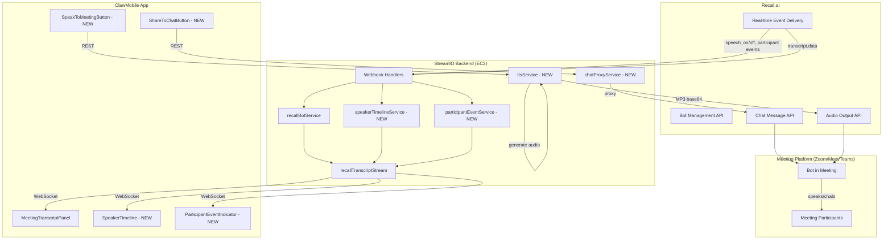
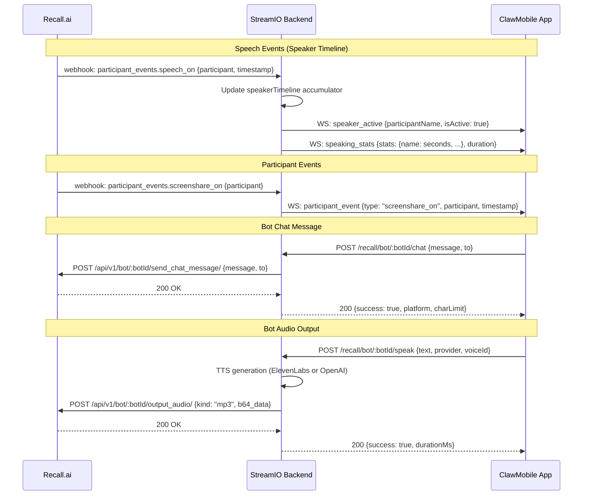

# System Architecture Plan: Recall.ai Phase 5-6 Features

**Date:** 2026-03-26
**Author:** Architecture Review
**Status:** Ready for Implementation
**Backend:** StreamIO (Node.js/TypeScript, EC2 us-west-1, https://api.streamio.ai)
**Mobile:** ClawMobile (Expo/React Native, TypeScript, Zustand)

---

## Section 1: PROBLEM STATEMENT & SCOPE

### Problem Statement

ClawMobile's meeting bot currently joins meetings and streams real-time transcripts, but the experience has critical gaps: all speakers show as "Speaker" instead of their names, agent insights are trapped inside the app (invisible to other meeting participants), and there's no visibility into who's talking when or what participants are doing (camera/mic/screenshare). This plan adds five features that transform the bot from a passive transcriber into an active, context-aware meeting participant — fixing speaker attribution, enabling the bot to communicate back into meetings via chat and voice, and providing real-time behavioral intelligence.

### Out of Scope

- Calendar integration (auto-deploy bots) — separate high-effort initiative
- Bot video output (camera feed/screenshare from bot) — future phase
- Receiving/reading chat messages from participants — future phase
- Auto-mode switching on screenshare detection — display events only
- Auto-sending chat messages without user approval

### Requirements

**Functional Requirements:**
1. Transcripts must show actual participant names instead of "Speaker"
2. Users can share action items and agent messages to the meeting chat via explicit tap
3. Real-time "currently speaking" indicator shows active speaker during meeting
4. Live speaking time distribution chart updates during meeting
5. Post-meeting summary shows final speaking time breakdown per participant
6. Participant events (camera/mic/screenshare/join/leave) display as indicators in transcript panel
7. Users can send agent responses as spoken audio into the meeting
8. Users can choose between ElevenLabs and OpenAI TTS for bot voice output
9. User confirmation required before bot speaks (no accidental audio)

**Non-Functional Requirements:**
- Speech events forwarded to mobile within 500ms of receipt
- Chat message delivery confirmed within 2 seconds
- Audio output latency (TTS generation + Recall.ai delivery) under 5 seconds
- No increase in mobile app bundle size beyond 50KB (logic only, no new native deps)

**Constraints:**
- Backend compiled locally, deployed to EC2 via rsync (no CI/CD pipeline)
- Recall.ai per-participant audio costs 1.8x standard transcription (~$0.27/hr vs $0.15/hr)
- Google Meet/Teams only fire `speech_off` on speaker change (no discrete `speech_on`)
- Bot audio output requires `automatic_audio_output` configured at bot creation time
- Google Meet chat limited to 500 characters; Zoom/Teams allow 4,096

---

## Section 2: ARCHITECTURE & SYSTEM DESIGN

### High-Level Architecture



### Data Flow: New Event Types



### Key Design Decisions

**Decision 1: Speech event processing on backend, not mobile**
- **Rationale:** Backend can normalize the Google Meet/Teams `speech_off`-only behavior into clean `speaker_active`/`speaking_stats` events. Mobile receives a consistent API regardless of platform.
- **Tradeoffs:** Slightly more backend complexity, but mobile code stays simple and platform-agnostic.

**Decision 2: TTS generation on backend**
- **Rationale:** API keys (ElevenLabs, OpenAI) stay server-side. Backend generates MP3, sends base64 directly to Recall.ai — mobile never handles audio blobs for this feature.
- **Tradeoffs:** Added latency (~1-3s for TTS generation), but avoids mobile-to-backend-to-Recall round-trip with large audio payloads.

**Decision 3: Subscribe to new events via webhook (not WebSocket)**
- **Rationale:** Backend already has Svix-verified webhook infrastructure for transcript and status events. Adding speech + participant events to the same pattern is consistent. The media WebSocket endpoints are reserved for high-bandwidth streams (video frames, raw audio).
- **Tradeoffs:** Slightly higher latency than direct WebSocket (~100-200ms), but webhooks are more reliable and don't require persistent connection management for event types.

**Decision 4: Silent MP3 in `automatic_audio_output` at bot creation**
- **Rationale:** Recall.ai requires `automatic_audio_output` to be configured during bot creation to unlock the on-demand `output_audio` endpoint. We set it to a 0.1s silent MP3 with `replay_on_participant_join` disabled — this is a no-op that just enables the API.
- **Tradeoffs:** Adds ~1KB to every bot creation payload, but it's a one-time cost per session.

**Decision 5: Explicit user approval for all bot-to-meeting communication**
- **Rationale:** Prevents accidental interruptions. Both chat messages and audio output require a deliberate user tap.
- **Tradeoffs:** Slightly more friction, but trust and control are paramount for a bot in someone else's meeting.

---

## Section 3: DATA MODEL & API CONTRACTS

### New TypeScript Types

```typescript
// types/recall.ts — additions

// Speaker Timeline
interface SpeechEvent {
  participantId: number;
  participantName: string;
  type: 'speech_on' | 'speech_off';
  timestamp: { absolute: string; relative: number };
}

interface SpeakingStats {
  [participantName: string]: {
    totalSeconds: number;
    percentage: number;
    isActive: boolean;
    segments: { start: number; end: number | null }[];
  };
}

interface SpeakerTimelineSummary {
  totalDuration: number;
  stats: SpeakingStats;
  dominantSpeaker: string;
  silencePercentage: number;
}

// Participant Events
type ParticipantEventType =
  | 'join' | 'leave'
  | 'speech_on' | 'speech_off'
  | 'webcam_on' | 'webcam_off'
  | 'screenshare_on' | 'screenshare_off'
  | 'chat_message';

interface ParticipantEvent {
  type: ParticipantEventType;
  participant: {
    id: number;
    name: string | null;
    isHost: boolean;
    email: string | null;
  };
  timestamp: { absolute: string; relative: number };
  data?: { text?: string; to?: string }; // chat_message only
}

// Bot Chat
interface SendChatRequest {
  message: string;
  to?: string; // recipient (Zoom only for DMs)
}

interface SendChatResponse {
  success: boolean;
  platform: MeetingPlatform;
  charLimit: number;
  truncated: boolean;
}

// Bot Audio Output
type TTSProvider = 'elevenlabs' | 'openai';

interface SpeakToMeetingRequest {
  text: string;
  provider: TTSProvider;
  voiceId: string;
}

interface SpeakToMeetingResponse {
  success: boolean;
  durationMs: number;
  provider: TTSProvider;
  charCount: number;
}
```

### New API Endpoints

#### Backend REST Endpoints (added to `recallRoutes.ts`)

| Method | Path | Description |
|--------|------|-------------|
| `POST` | `/api/v1/recall/bot/:botId/chat` | Send chat message into meeting |
| `POST` | `/api/v1/recall/bot/:botId/speak` | Send TTS audio into meeting |
| `GET` | `/api/v1/recall/bot/:botId/speakers` | Get current speaking stats |
| `GET` | `/api/v1/recall/bot/:botId/speakers/summary` | Get post-meeting speaker summary |
| `GET` | `/api/v1/recall/bot/:botId/events` | Get participant event log |

#### Webhook Endpoints (added to `recallRoutes.ts`)

| Method | Path | Description |
|--------|------|-------------|
| `POST` | `/api/v1/recall/webhooks/participant-events` | Receive speech + participant events |

#### WebSocket Events (added to `recallTranscriptStream.ts`)

| Event | Direction | Payload |
|-------|-----------|---------|
| `speaker_active` | Server → Client | `{ participantName, isActive, timestamp }` |
| `speaking_stats` | Server → Client | `{ stats: SpeakingStats, duration }` |
| `participant_event` | Server → Client | `{ type, participant, timestamp, data? }` |

### Request/Response Examples

**Send Chat Message:**
```
POST /api/v1/recall/bot/abc-123/chat
Authorization: Bearer <jwt>

{ "message": "[Action Item] Sarah: API migration by April 15" }

Response 200:
{ "success": true, "platform": "zoom", "charLimit": 4096, "truncated": false }
```

**Speak to Meeting:**
```
POST /api/v1/recall/bot/abc-123/speak
Authorization: Bearer <jwt>

{
  "text": "Quick summary: 3 action items were captured today.",
  "provider": "openai",
  "voiceId": "alloy"
}

Response 200:
{ "success": true, "durationMs": 4200, "provider": "openai", "charCount": 50 }
```

---

## Section 4: PHASED IMPLEMENTATION PLAN

### Phase 1: Perfect Diarization + Event Subscription Infrastructure

**Goal:** Fix the "Speaker" name issue immediately, and lay the backend groundwork for all event-based features.

**Deliverables:**

1. **Backend: Enable perfect diarization in bot creation payload** (`recallBotService.ts`)
   - Add `diarization: { use_separate_streams_when_available: true }` to `recording_config.transcript`
   - Update cost estimate from `$0.65/hr` to `$0.77/hr` in response

2. **Backend: Add participant event webhook endpoint** (`recallRoutes.ts`)
   - New handler `POST /api/v1/recall/webhooks/participant-events`
   - Svix signature verification (same pattern as existing webhooks)
   - Routes events to appropriate service based on event type

3. **Backend: Subscribe to new events in bot creation** (`recallBotService.ts`)
   - Add to `realtime_endpoints`:
     ```typescript
     {
       type: 'webhook',
       url: 'https://api.streamio.ai/api/v1/recall/webhooks/participant-events',
       events: [
         'participant_events.speech_on',
         'participant_events.speech_off',
         'participant_events.join',
         'participant_events.leave',
         'participant_events.webcam_on',
         'participant_events.webcam_off',
         'participant_events.screenshare_on',
         'participant_events.screenshare_off',
       ],
     }
     ```

4. **Backend: Add `automatic_audio_output` to bot creation payload** (`recallBotService.ts`)
   - Include silent MP3 base64 constant with `replay_on_participant_join` disabled
   - This is a prerequisite for Phase 3's audio output — deploy it now to avoid a second bot creation payload change

5. **Backend: Build and deploy to EC2**
   - Compile locally (`npx tsc`), rsync `dist/` to server, restart service

**Dependencies:** None — this phase is purely backend config changes.

**Files Modified:**
- `src/services/recallBotService.ts` — bot creation payload
- `src/routes/recallRoutes.ts` — new webhook route
- `src/constants/silentMp3.ts` — NEW: base64 silent MP3 constant (~1KB)

---

### Phase 2: Speaker Timeline + Bot Chat Messages

**Goal:** Real-time speaking visualization during meetings, post-meeting speaker summary, and ability to share messages to meeting chat.

#### Phase 2A: Speaker Timeline

**Backend Deliverables:**

6. **New service: `speakerTimelineService.ts`**
   - In-memory state: `Map<botId, SpeakerTimelineState>`
   - `SpeakerTimelineState`:
     ```typescript
     {
       participants: Map<participantId, {
         name: string;
         totalMs: number;
         currentStart: number | null; // relative timestamp if currently speaking
         segments: { start: number; end: number | null }[];
       }>;
       meetingStartTime: number;
     }
     ```
   - `handleSpeechEvent(botId, event)`:
     - On `speech_on`: set `currentStart`, add open segment, emit `speaker_active`
     - On `speech_off`: calculate delta, add to `totalMs`, close segment, emit `speaker_active` (isActive: false)
     - **Meet/Teams workaround:** On `speech_off` for participant A, if no other participant has an open `speech_on`, infer that the *next* `speech_off` recipient was speaking since A stopped. Track `lastSpeechOff` timestamp and backfill when the next event arrives.
   - `getStats(botId)`: return current `SpeakingStats` with percentages
   - `getSummary(botId)`: return `SpeakerTimelineSummary` with dominant speaker, silence %
   - Periodic broadcast: every 5 seconds, emit `speaking_stats` to all connected clients for that bot

7. **Wire speech events through webhook handler** (`recallRoutes.ts`)
   - Filter `participant_events.speech_on` and `participant_events.speech_off`
   - Call `speakerTimelineService.handleSpeechEvent()`

8. **Add WebSocket event emission** (`recallTranscriptStream.ts`)
   - New broadcast functions: `emitSpeakerActive()`, `emitSpeakingStats()`
   - Called from `speakerTimelineService`

9. **REST endpoints for polling/summary** (`recallRoutes.ts`)
   - `GET /bot/:botId/speakers` — current stats
   - `GET /bot/:botId/speakers/summary` — post-meeting summary

**Mobile Deliverables:**

10. **New types** (`types/recall.ts`)
    - `SpeechEvent`, `SpeakingStats`, `SpeakerTimelineSummary`

11. **Update `meetingBotStore.ts`**
    - New state: `speakingStats: SpeakingStats`, `activeSpeaker: string | null`
    - New actions: `updateSpeakingStats()`, `setActiveSpeaker()`

12. **Update `useMeetingBot.ts` hook**
    - Handle new WebSocket events: `speaker_active`, `speaking_stats`
    - Route to store actions
    - On session end, fetch summary from REST endpoint

13. **New component: `ActiveSpeakerIndicator.tsx`** (`components/meeting/`)
    - Small badge/pill showing "John is speaking" with animated pulse
    - Positioned above transcript panel
    - Shows nothing when no one is speaking

14. **New component: `SpeakingTimeChart.tsx`** (`components/meeting/`)
    - Horizontal bar chart per participant
    - Color-coded bars with percentage labels
    - Updates every 5 seconds during meeting
    - Collapsible section within the meeting panel

15. **New component: `SpeakerSummaryCard.tsx`** (`components/meeting/`)
    - Post-meeting card showing final breakdown
    - Dominant speaker highlight
    - Silence percentage
    - Rendered in meeting history / transcript review

#### Phase 2B: Bot Chat Messages

**Backend Deliverables:**

16. **New proxy endpoint** (`recallRoutes.ts`)
    - `POST /api/v1/recall/bot/:botId/chat`
    - Validates message length against platform char limit
    - Truncates with `[...]` suffix if over limit (returns `truncated: true`)
    - Proxies to `POST https://{region}.recall.ai/api/v1/bot/{botId}/send_chat_message/`
    - Platform char limits: `{ zoom: 4096, google_meet: 500, teams: 4096, slack: Infinity }`

17. **Add platform to active session state** (`recallBotService.ts`)
    - Ensure `platform` is accessible for char limit lookup when chat endpoint is called

**Mobile Deliverables:**

18. **New service method** (`services/recall/recallService.ts`)
    - `sendChatMessage(botId: string, message: string, to?: string): Promise<SendChatResponse>`

19. **New component: `ShareToChatButton.tsx`** (`components/meeting/`)
    - Appears on action items in `ActionItemsList.tsx` and agent messages
    - Tap shows confirmation sheet: "Send to meeting chat?" with message preview
    - Shows platform char limit warning if message is long
    - Loading state during send, success/error toast feedback

20. **Update `ActionItemsList.tsx`**
    - Add `ShareToChatButton` next to confirm/dismiss buttons for confirmed action items

**Files Modified (Phase 2):**
- Backend: `recallBotService.ts`, `recallRoutes.ts`, `recallTranscriptStream.ts`
- Backend NEW: `src/services/speakerTimelineService.ts`
- Mobile: `types/recall.ts`, `meetingBotStore.ts`, `useMeetingBot.ts`, `ActionItemsList.tsx`
- Mobile: `services/recall/recallService.ts`
- Mobile NEW: `ActiveSpeakerIndicator.tsx`, `SpeakingTimeChart.tsx`, `SpeakerSummaryCard.tsx`, `ShareToChatButton.tsx`

**Dependencies:** Phase 1 must be deployed (event subscriptions active, webhook endpoint live).

---

### Phase 3: Participant Events + Bot Audio Output

**Goal:** Display participant behavior indicators in the transcript panel, and enable the bot to speak in meetings using TTS.

#### Phase 3A: Participant Events

**Backend Deliverables:**

21. **New service: `participantEventService.ts`**
    - In-memory event log: `Map<botId, ParticipantEvent[]>`
    - `handleEvent(botId, event)`: store event, emit to WebSocket clients
    - `getEvents(botId)`: return full event log for the session
    - Normalizes Recall.ai payload into clean `ParticipantEvent` type

22. **Wire participant events through webhook handler** (`recallRoutes.ts`)
    - Filter `participant_events.join`, `.leave`, `.webcam_on`, `.webcam_off`, `.screenshare_on`, `.screenshare_off`
    - Call `participantEventService.handleEvent()`

23. **Add WebSocket event emission** (`recallTranscriptStream.ts`)
    - New broadcast function: `emitParticipantEvent()`

24. **REST endpoint** (`recallRoutes.ts`)
    - `GET /bot/:botId/events` — full event log (for reconnection / history)

**Mobile Deliverables:**

25. **Update `meetingBotStore.ts`**
    - New state: `participantEvents: ParticipantEvent[]`
    - New action: `addParticipantEvent()`

26. **Update `useMeetingBot.ts` hook**
    - Handle `participant_event` WebSocket event
    - Route to store

27. **New component: `ParticipantEventIndicator.tsx`** (`components/meeting/`)
    - Inline indicator rendered between transcript lines
    - Distinct styling per event type:
      - Join/leave: muted text ("Sarah joined the meeting")
      - Camera: camera icon + on/off
      - Screenshare: screen icon + started/stopped
    - Timestamp aligned with transcript timestamps

28. **Update `MeetingTranscriptPanel.tsx`**
    - Interleave `ParticipantEventIndicator` items with transcript lines based on timestamp ordering

#### Phase 3B: Bot Audio Output

**Backend Deliverables:**

29. **New service: `ttsService.ts`**
    - `generateAudio(text, provider, voiceId): Promise<{ b64Data: string, durationMs: number }>`
    - **ElevenLabs path:**
      - `POST https://api.elevenlabs.io/v1/text-to-speech/{voiceId}`
      - Body: `{ text, model_id: "eleven_turbo_v2_5" }`
      - Response: MP3 binary → base64 encode
    - **OpenAI path:**
      - `POST https://api.openai.com/v1/audio/speech`
      - Body: `{ model: "tts-1", voice: voiceId, input: text, response_format: "mp3" }`
      - Response: MP3 binary → base64 encode
    - Returns base64 MP3 string + estimated duration

30. **New endpoint: speak to meeting** (`recallRoutes.ts`)
    - `POST /api/v1/recall/bot/:botId/speak`
    - Validates bot is in `recording` state
    - Calls `ttsService.generateAudio()`
    - Proxies MP3 to `POST https://{region}.recall.ai/api/v1/bot/{botId}/output_audio/`
    - Body: `{ kind: "mp3", b64_data: "<base64>" }`

31. **Add TTS API keys to config** (`config/index.ts`)
    - `ELEVENLABS_API_KEY` (may already exist)
    - `OPENAI_TTS_API_KEY`

**Mobile Deliverables:**

32. **New service method** (`services/recall/recallService.ts`)
    - `speakToMeeting(botId, text, provider, voiceId): Promise<SpeakToMeetingResponse>`

33. **New component: `SpeakToMeetingButton.tsx`** (`components/meeting/`)
    - Appears on agent responses in the chat/transcript
    - Tap shows confirmation sheet:
      - Message preview (text that will be spoken)
      - TTS provider toggle (ElevenLabs / OpenAI)
      - Voice selector (reuse existing voice picker from STT/TTS settings)
      - "Speak" confirmation button
    - Loading state during TTS + delivery
    - Success toast: "Bot spoke in meeting (4.2s)"

34. **New component: `TTSProviderPicker.tsx`** (`components/meeting/`)
    - Simple toggle between ElevenLabs and OpenAI
    - Shows available voices per provider
    - Persists selection in settings store

35. **Update settings store**
    - New preferences: `preferredTTSProvider`, `preferredTTSVoiceId`

**Files Modified (Phase 3):**
- Backend: `recallRoutes.ts`, `recallTranscriptStream.ts`, `config/index.ts`
- Backend NEW: `src/services/participantEventService.ts`, `src/services/ttsService.ts`
- Mobile: `types/recall.ts`, `meetingBotStore.ts`, `useMeetingBot.ts`, `MeetingTranscriptPanel.tsx`
- Mobile: `services/recall/recallService.ts`, settings store
- Mobile NEW: `ParticipantEventIndicator.tsx`, `SpeakToMeetingButton.tsx`, `TTSProviderPicker.tsx`

**Dependencies:** Phase 1 must be deployed (event subscriptions + `automatic_audio_output` config).

---

## Section 5: TESTING STRATEGY

### Per-Feature Validation

**Perfect Diarization (Phase 1):**
- Deploy bot to a Zoom meeting with 2+ participants
- Verify transcript shows actual participant names instead of "Speaker"
- Confirm on Google Meet and Teams as well

**Speaker Timeline (Phase 2A):**
- Deploy bot, have 2 participants alternate speaking
- Verify `speaker_active` events appear in real-time (check WebSocket messages)
- Verify bar chart updates every 5 seconds
- Test Google Meet: confirm backend infers active speaker correctly from `speech_off`-only events
- End meeting, verify post-meeting summary shows correct percentages

**Bot Chat Messages (Phase 2B):**
- Deploy bot to Zoom, confirm an action item, tap "Share to Meeting"
- Verify message appears in Zoom chat for all participants
- Test with Google Meet: verify 500-char truncation works
- Test error case: bot has left meeting, tap share — verify error toast

**Participant Events (Phase 3A):**
- Deploy bot, have participant toggle camera and start screenshare
- Verify indicators appear in transcript panel at correct timestamps
- Verify join/leave events display

**Bot Audio Output (Phase 3B):**
- Deploy bot, trigger agent response, tap "Speak to Meeting"
- Verify audio plays in meeting (all participants hear it)
- Test both ElevenLabs and OpenAI providers
- Test confirmation flow prevents accidental sends
- Test error case: bot not recording — verify button is disabled

### Acceptance Criteria

| Phase | Criteria |
|-------|----------|
| Phase 1 | Transcripts show real names on Zoom/Meet/Teams. New webhook endpoint returns 200 for test payload. Bot creation includes `automatic_audio_output`. |
| Phase 2A | Active speaker indicator updates within 1 second. Bar chart shows accurate percentages. Post-meeting summary available after bot leaves. |
| Phase 2B | Chat message appears in meeting within 2 seconds of tap. Char limit enforced per platform. Confirmation sheet prevents accidental sends. |
| Phase 3A | All 6 event types display as indicators in transcript panel. Events interleaved with transcript in correct timestamp order. |
| Phase 3B | Bot speaks audibly in meeting. Both TTS providers produce clear audio. Confirmation required before every utterance. |

---

## Section 6: INFRASTRUCTURE & DEPLOYMENT

### Deployment Process (per phase)

Each phase follows the established EC2 deployment pattern:

1. **Local build:** `cd /Users/omatsone/Downloads/ovai_mobile/Consolidated/screenshare/backend && npx tsc`
2. **Verify compiled output:** Check new files exist in `dist/`
3. **SSH and backup:** `cp -r dist/ dist.backup.$(date +%Y%m%d_%H%M%S)/`
4. **Rsync dist/:** Transfer compiled JS to EC2
5. **Update .env (Phase 3 only):** Add `OPENAI_TTS_API_KEY` if not present
6. **Restart:** `sudo systemctl restart streamio-backend`
7. **Verify:** Health check + feature-specific validation
8. **Mobile:** Update app, test against production backend

### Environment Variables

| Variable | Phase | Notes |
|----------|-------|-------|
| `RECALL_API_KEY` | Existing | Already configured |
| `RECALL_WEBHOOK_SECRET` | Existing | Used for Svix verification on new webhook |
| `ELEVENLABS_API_KEY` | Phase 3 | May already exist (STT integration) |
| `OPENAI_TTS_API_KEY` | Phase 3 | New — add to EC2 `.env` |

### Cost Impact

| Feature | Additional Cost | When |
|---------|----------------|------|
| Perfect Diarization | +$0.12/hr per bot | Phase 1 |
| Speech + Participant Events | Free | Phase 1 |
| Bot Chat Messages | Free | Phase 2 |
| Speaker Timeline | Free | Phase 2 |
| Bot Audio Output (ElevenLabs) | ~$0.01-0.05/utterance | Phase 3 |
| Bot Audio Output (OpenAI) | ~$0.015/1K chars | Phase 3 |

**Updated per-session cost:** $0.77/hr base (up from $0.65/hr) + TTS per utterance

---

## Section 7: OPEN QUESTIONS & NEXT STEPS

### Open Questions

1. **Recall.ai webhook secret reuse:** Can the existing `RECALL_WEBHOOK_SECRET` verify signatures on the new participant events webhook, or does Recall.ai issue a separate secret per endpoint?
2. **ElevenLabs API key:** Is the existing key (from STT) authorized for TTS as well, or is a separate key/plan needed?
3. **Google Meet `speech_off`-only behavior:** Need to validate the backend inference logic with real Meet meetings — the workaround may need tuning based on actual event timing patterns.
4. **Recall.ai `automatic_audio_output` silent MP3:** Need to verify the minimum viable silent MP3 that Recall.ai accepts (duration, encoding params).

### Immediate Next Steps

1. **Generate a 0.1s silent MP3 base64 string** for the `automatic_audio_output` config — test that Recall.ai accepts it during bot creation
2. **Add `diarization` config + event subscriptions to bot creation payload** in `recallBotService.ts` — this is a single code change that unlocks Phase 1
3. **Add the participant events webhook route** with Svix verification — deploy and test with a real meeting to confirm events arrive
4. **Build `speakerTimelineService.ts`** — start with Zoom (clean `speech_on`/`speech_off` pairs) before tackling the Meet/Teams workaround
5. **Deploy Phase 1 to EC2** and validate diarization works on all three platforms (Zoom, Meet, Teams)
